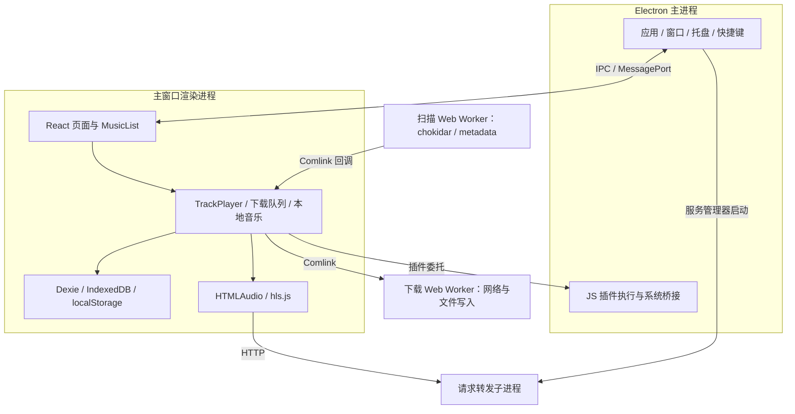
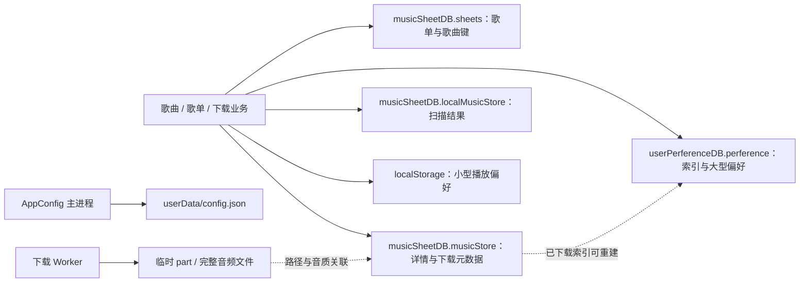

# 01 · 代码库知识地图

[返回目录](README.md)

## 1. 软件定位与平台

MusicFreeDesktop 是以插件提供在线音源、以本地存储保存个人歌单的桌面播放器。它具备本地音乐、搜索、歌单、歌词、桌面歌词、迷你窗口、主题、备份和下载能力。在线功能取决于已安装插件的方法和返回数据，不应把播放器 UI 有入口等同于任意插件都支持它。

代码以 **Electron + TypeScript + React + SCSS** 为主。README 明确说明 Windows、macOS、Linux；[构建工作流](../../.github/workflows/build.yml)包含 Windows、macOS x64/ARM64 和 Ubuntu 作业，[Forge 配置](../../forge.config.ts)包含相应打包器。这是代码和构建意图；本次没有验证 macOS、Linux 当前构建能否成功。

### 平台支持矩阵

| 平台 | 仓库声明与构建配置 | 平台适配证据 | 本轮验证程度 |
| --- | --- | --- | --- |
| Windows | 普通与 legacy 构建作业；安装器和便携 ZIP，产物命名为 x64 | main 的 portable 分支；任务栏缩略图与原生 `.node` 模块 | 文件同步阶段 8 组 Node 通过；加入唱片效果后 7 组 Electron、编译页面验收通过；并非全功能验证 |
| macOS | x64 与 arm64 作业；DMG，Forge 另配置 ZIP | main 的 darwin 生命周期、窗口与托盘分支 | 已审查配置和源码，未在 Mac 上重新构建/运行 |
| Linux | Ubuntu 作业；amd64 DEB；RPM maker 未启用 | tray-manager 的 linux 分支 | WSL Linux 文件检查与真实目录监听回归通过；未重新构建/运行 Linux GUI |

结论：**代码库设计支持 Linux、Windows、macOS。** 这不等于当前 CI 都能成功或每个平台功能完全一致。Linux 现有打包路径主要面向 Debian/Ubuntu 系列；本轮不据此承诺所有发行版、桌面环境或 Wayland/X11 组合。Windows ARM64、Linux ARM64 也不在当前列出的构建矩阵中。

证据：[README](../../README.md#L26)、[构建作业](../../.github/workflows/build.yml)、[Forge](../../forge.config.ts)、[平台入口](../../src/main/index.ts)、[托盘适配](../../src/main/tray-manager/index.ts)、[任务栏模块加载](../../src/common/thumb-bar-util.ts#L76)。Windows 原生缩略图模块在调用前检查 `win32`，不能因为它存在就推断其他平台无法运行。

## 2. 技术栈与职责

| 层 | 当前技术 | 承担的职责 |
| --- | --- | --- |
| 桌面宿主 | Electron，依赖声明 `^25.3.0` | 窗口、托盘、快捷键、协议、任务栏、文件系统与进程 |
| 界面 | React，依赖声明 `^18.3.1`；React Router | 页面、歌曲表格、弹窗、歌词、状态展示 |
| 播放 | `HTMLAudioElement` + hls.js | 普通音频与 HLS 播放，设备选择、音量、倍速 |
| 状态 | 自定义 Store + EventEmitter | 业务状态更新、组件订阅、下载状态通知 |
| 多窗口通信 | IPC + MessagePort | 主窗口、歌词窗口、迷你窗口的命令与状态同步 |
| 当前业务存储 | Dexie / IndexedDB、localStorage、JSON | 歌单、歌曲、下载元数据、偏好与设置 |
| 后台任务 | Web Worker + Comlink；子进程 | 下载、目录扫描、请求转发 |
| 构建 | Electron Forge + Webpack + 原生模块重建 | 平台包与资源处理 |

依赖版本范围来自 [package.json](../../package.json)，不等于安装时必然解析到的精确版本。需要升级的是受支持的 Electron 版本及相关兼容性；不能单独改版本号后直接发布。

## 3. 进程与模块地图

图中的后台区域同时包含 Worker 和请求转发子进程，它们不是同一种进程。图中省略 Chromium 自己的 GPU、网络和音频服务进程。

### 用 C/C++ 与嵌入式经验理解执行模型

| 本项目概念 | 可以借用的经验 | 必须区分的地方 |
| --- | --- | --- |
| 主进程 / Renderer | 系统宿主与界面进程，边界通过消息通信 | `src/main` 是 JS 运行环境，业务并非全在这里；Electron 还有内部服务进程 |
| Web Worker | 将工作提交到独立执行上下文，接收消息结果 | 不是共享全部对象的 C++ 线程；Comlink 代理调用返回 Promise，跨边界的数据有复制/传输约束 |
| Promise / async / await | 异步 I/O 完成回调、状态机的挂起与恢复 | `await` 不等于创建线程；它让出当前异步函数，之后继续执行，结果可能已过时 |
| Store / EventEmitter | 状态容器与观察者回调 | Store 已提交后通知并隔离订阅错误（BUG-09）；其他 EventEmitter 回调仍需自行处理异常 |
| React state | 状态变化驱动界面刷新 | 界面渲染与设备时钟不是同一个时钟；不能用渲染频率代替音频播放进度 |
| 资源生命周期 | RAII、句柄所有权、退出清理 | TS/JS 的 GC 不自动完成 `destroy`、取消请求、释放 Object URL 或移除监听器 |
| TypeScript interface | 编译期接口约束 | 编译后没有自动运行时校验；插件返回值和 IPC 输入仍需检查 |

因此，阅读播放/下载代码时先标记**谁拥有状态、谁提交结果、谁负责取消和释放**。单个 JS 执行上下文通常顺序执行回调，多个异步请求仍可乱序完成；BUG-01/02 属于这种竞态，而非一定存在两个线程同时写内存。

### 主进程

[src/main/index.ts](../../src/main/index.ts)建立便携目录、单实例锁和 `musicfree://` 协议，初始化设置、插件、托盘、快捷键、服务和窗口。

[window-manager](../../src/main/window-manager/index.ts)负责三类窗口及其关闭、大小、拖动等行为。主窗口关闭后的结果由设置和平台分支共同决定；托盘隐藏不等于程序退出。

### 主界面与业务核心

[renderer/document/index.tsx](../../src/renderer/document/index.tsx)先等待 bootstrap，再挂载 React。业务集中在 `src/renderer/core`：播放、歌单、本地音乐、下载、最近播放、歌词关联和备份。

当前播放核心和下载队列都由主窗口渲染侧管理。音频解码不是所有工作都在 JavaScript UI 线程执行，但播放命令、事件处理和状态组织依赖此渲染进程。后续应测量 UI 卡顿是否影响控制延迟，不能直接断言每次卡顿都会断音。

### 插件与系统边界

插件委托调用经过 renderer / preload / main；[plugin.ts](../../src/shared/plugin-manager/main/plugin.ts)使用 `Function` 执行 JavaScript 插件，并提供 axios、cheerio 等预置包。白名单 `require` 属于兼容接口，不能视为操作系统沙箱。

`src/shared` 的 main、preload、renderer 文件是按进程分拆的桥接和实现。阅读时应追踪具体调用，不宜仅按文件夹名称假定所有 shared 模块都在同一进程。

## 4. 数据到底存在哪里？

| 数据 | 实际位置/结构 | 读取入口 |
| --- | --- | --- |
| 应用设置 | `app.getPath('userData')/config.json` | [AppConfig](../../src/shared/app-config/main.ts) |
| 歌单 | `musicSheetDB.sheets`，`id` 主键，`musicList` 保存歌曲键 | [music-sheet/backend](../../src/renderer/core/music-sheet/backend/index.ts) |
| 歌曲详情 | `musicSheetDB.musicStore`，`[platform+id]` 复合键 | [music-sheet-db.ts](../../src/renderer/core/db/music-sheet-db.ts) |
| 本地扫描结果 | `musicSheetDB.localMusicStore`，带 `$$localPath` | [local-music](../../src/renderer/core/local-music/index.ts) |
| 大型偏好 | `userPerferenceDB.perference`，`key/value` | [user-perference.ts](../../src/renderer/utils/user-perference.ts) |
| 小型偏好 | localStorage：当前歌曲、播放位置、音量等 | 同上 |
| 已下载文件 | 用户配置的下载目录 | [downloader worker](../../src/webworkers/downloader.ts) |
| 已下载记录 | 歌曲详情中的 `$` / `downloadData`：路径、音质与可选文件身份；偏好库保存可重建的列表索引 | [downloaded-sheet.ts](../../src/renderer/core/downloader/downloaded-sheet.ts)、[10 状态同步](10-download-file-state.md) |
| 插件与主题 | 由对应 main 模块管理的本地目录 | [插件管理](../../src/shared/plugin-manager/main/index.ts)、[主题管理](../../src/shared/themepack/main.ts) |

IndexedDB 的物理文件属于 Electron 浏览器 profile；迁移时应通过业务导出/导入，避免直接把数据库底层文件当成稳定交换格式。

歌曲的身份由来源 `platform` 和 `id` 确定；[media-util](../../src/common/media-util.ts)统一比较和生成键。列表位置会因排序、过滤和分页改变，不能作为持久身份。

### SQLite 代码与当前主链路的区别

仓库有 [shared/database/preload.ts](../../src/shared/database/preload.ts)、`preload-backup.ts` 和 [db-worker.ts](../../src/webworkers/db-worker.ts) 等 SQLite 代码，但当前 preload 入口未导入上述数据库模块，主歌单入口走 Dexie。`db-worker.ts` 还有空数据库路径。它们应先做依赖和迁移核查，不能据此描述当前歌单已统一使用 SQLite。

特别注意：[music-sheet/frontend/index.ts](../../src/renderer/core/music-sheet/frontend/index.ts)仍然 `export * from './index.old'`。**文件名带 old 不意味着可以删除。** 同样，备用下载实现需要核实导入关系后再归档。

## 5. 源码导航：需求落点

| 要改什么 | 从哪里开始 | 需一起检查 |
| --- | --- | --- |
| 列表选择、批量操作 | [MusicList](../../src/renderer/components/MusicList/index.tsx) | 分页、排序、过滤、虚拟列表、右键和键盘 |
| 播放/切歌/音质 | [track-player](../../src/renderer/core/track-player/index.ts) | 异步请求时序、音频控制器、歌词 |
| 音频输出、HLS | [audio-controller](../../src/renderer/core/track-player/controller/audio-controller.ts) | 请求转发、设备、资源释放 |
| 歌单增删/收藏 | [frontend](../../src/renderer/core/music-sheet/frontend/index.old.ts) → [backend](../../src/renderer/core/music-sheet/backend/index.ts) | 去重、事务、引用计数、失败回传 |
| 扫描本地文件 | [local-music](../../src/renderer/core/local-music/index.ts) → [local-file-watcher](../../src/webworkers/local-file-watcher.ts) | 初始扫描、增删改、大小写、封面 |
| 下载任务 | [downloader](../../src/renderer/core/downloader/index.ts) → [worker](../../src/webworkers/downloader.ts) | 状态、暂停、HTTP、磁盘、记录提交 |
| 下载资源同步 | [downloaded-sheet](../../src/renderer/core/downloader/downloaded-sheet.ts) → preload 文件检查/监听 | 独立资源状态、身份校验、移动恢复、播放回退；详见 [10](10-download-file-state.md) |
| 下载管理页面 | [download-view](../../src/renderer/pages/main-page/views/download-view/index.tsx) | 已下载状态与待下载任务的一致性 |
| 搜索与插件 | [plugin-manager](../../src/shared/plugin-manager/renderer.ts) | 方法能力、返回数据、超时与取消 |
| 桌面歌词/迷你窗口 | [renderer-lrc](../../src/renderer-lrc/pages/index.tsx)、[renderer-minimode](../../src/renderer-minimode/pages/index.tsx) | MessagePort、窗口状态、DPI |
| Windows 任务栏 | [thumb-bar-util](../../src/common/thumb-bar-util.ts) | [原生模块](../../src/main/native_modules/TaskbarThumbnailManager/TaskbarThumbnailManager.node.d.ts)、窗口句柄 |
| 设置、快捷键、主题 | `src/shared/{app-config,short-cut,themepack}` | 多窗口更新、文件写入、权限边界 |

## 6. 已有优势与应保留的设计

- 在线音源通过插件协议解耦，UI 和音源可以分别演进。
- 歌曲身份已有统一帮助函数，便于去重与稳定选择。
- 本地扫描和下载已有后台 Worker，适合继续引入批处理和限流。
- 主窗口、歌词窗口和迷你模式已有消息通信基础。
- 列表已虚拟化；应优化计算和订阅，不应简单改回全量 DOM。
- 本次基线已修复下载提交后的状态一致性，并补有实际 Windows Electron 回归测试。

## 7. 术语速查

| 术语 | 在本项目里的含义 |
| --- | --- |
| Renderer | React 界面及目前大部分业务所在的 Electron 渲染进程 |
| Preload / IPC | 连接界面与系统能力的边界代码/通信 |
| Comlink | 把 Worker 消息包装成类似异步函数调用 |
| Dexie | IndexedDB 的访问库 |
| HLS / m3u8 | 播放清单引用多个媒体分片，清单本身不等于完整音频 |
| SMTC | Windows 的系统媒体播放控制；不是任务栏缩略图按钮 |
| WASAPI | Windows 音频输出接口；共享和独占是不同模式 |
| Gapless | 正确消除曲目衔接中的非音乐空隙，与交叉淡化不同 |
