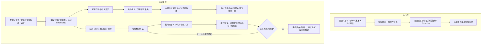
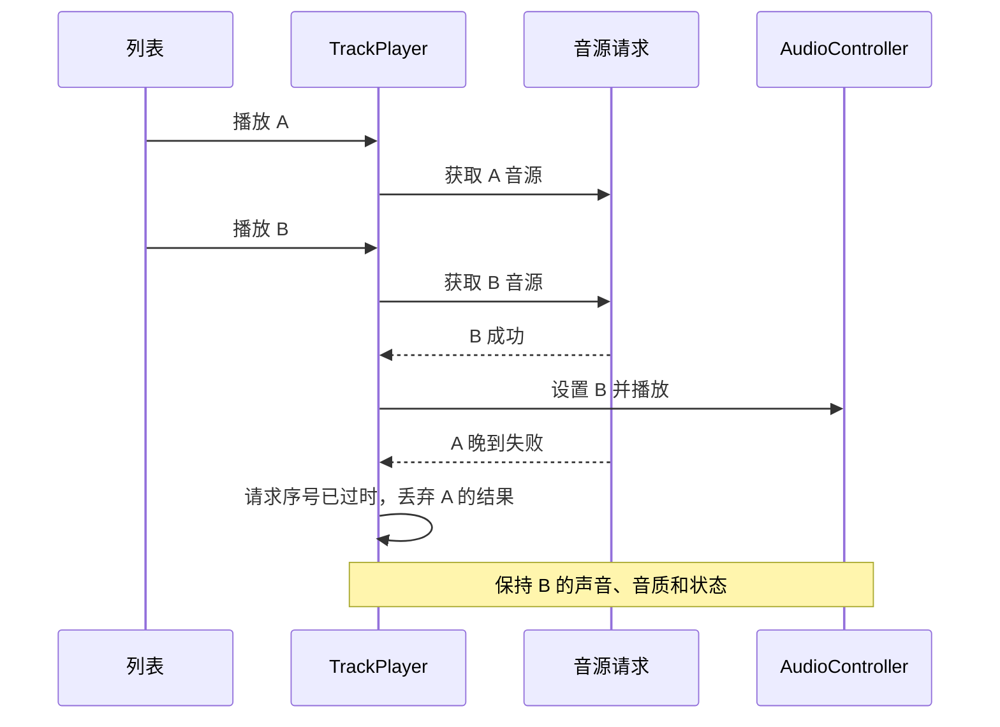
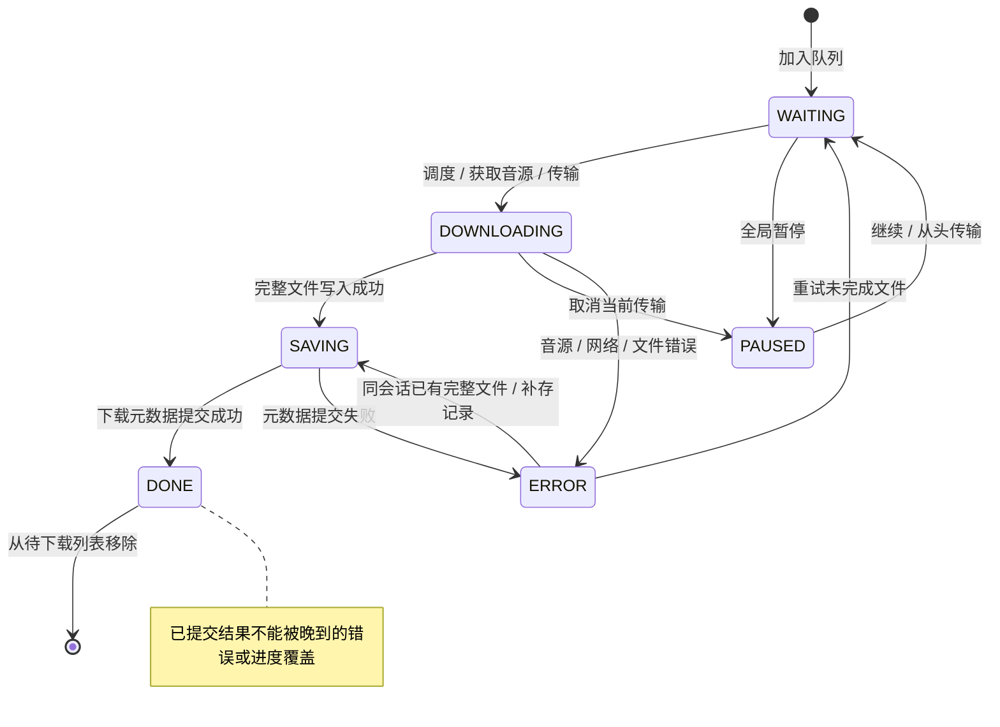

# 02 · 核心流程与 Windows 开发指南

[返回目录](README.md)

## 1. 启动顺序

1. `src/main/index.ts` 识别 Windows 便携目录，申请单实例锁。
2. `app.whenReady()` 初始化全局路径、设置、语言、插件、托盘、快捷键和消息总线，创建暂时隐藏的主窗口；青花 HTML 首帧完成后再显示窗口。
3. `renderer/document/startup.js` 先让本地青花骨架绘制，再动态加载完整播放器。`renderer/document/bootstrap.ts` 先初始化设置/插件，再初始化歌单/播放器，随后建立扫描、下载记录索引、最近播放和服务状态。下载文件核对与旧记录 SHA-256 补建在后台分批执行。
4. `renderer/document/index.tsx` 先挂载 React 的 Initialize 界面；bootstrap 成功后挂载播放器，失败则显示阶段与错误，提供整页重载重试。主窗口通过 IPC/MessagePort 向托盘、歌词窗口和迷你窗口同步状态。

源码入口：[main](../../src/main/index.ts)、[bootstrap](../../src/renderer/document/bootstrap.ts)、[轻量启动入口](../../src/renderer/document/startup.js)、[React 入口](../../src/renderer/document/index.tsx)、[Initialize](../../src/renderer/document/initialize.tsx)。BUG-11 已修复并通过真实 React 首屏验证。

最新的窗口白屏、主题首帧与标题修复见 [13 的启动说明](13-jiangnan-theme-implementation.md)。完整播放器准备前，启动骨架不提供歌曲播放操作；它显示准备状态并允许最小化或退出。

### 首屏与下载文件核对



**此前初始化等待的主要问题是下载记录中的磁盘检查，现已改为后台执行。** 没有文件指纹的旧记录还需要读取整首文件计算 SHA-256。唱片组件在主界面挂载后才出现，初始化等待期间没有旋转动画运行；因此本轮保留唱片效果。

- 首屏仍等待必要配置、歌单与播放状态、语言和下载记录索引，不等待全库文件核对。
- 未检查的记录保持 `CHECKING`，图标提示“正在核对本地文件”；不会直接宣称已下载。已下载列表在检查后逐批补全。
- 全库后台批次优先级为 -1，播放、下载和元数据写操作优先级为 1。同一批已经开始的文件检查会先完成；这不是抢占式取消，也不能保证断开的网络盘立即返回。
- 点播只等目标文件与已开始的一个小批次；下载前核对选中的已有记录，避免启动期间重复下载。外部删歌、改路径、同名文件身份检查和事务保护继续有效。
- 后台检查失败记录日志并进入补偿重试；每个启动阶段记录 `Startup stage` 与 `durationMs`，全库核对单独记录数量和时间。

隔离 Windows 编译版测试（1000 条记录，单次样本）：

| 场景 | 优化前初始化等待 | 优化后初始化等待 |
| --- | --- | --- |
| 旧下载记录，无文件指纹 | 2237ms | 39ms |
| 已有文件指纹 | 326ms | 41ms |

计时从前端 `Create Bundle` 开始，**不包含 exe、Electron 和静态模块加载**。无指纹场景的首屏为 2260ms → 58ms；全部后台核对约 8.3 秒，已下载列表逐批补齐。完整测试条件、吞吐量变化与边界见下方验证记录。

代码入口：[bootstrap](../../src/renderer/document/bootstrap.ts)、[下载初始化](../../src/renderer/core/downloader/index.ts)、[分批核对与优先级](../../src/renderer/core/downloader/downloaded-sheet.ts)。性能测量与复现见 [启动验证](evidence/startup-performance.md)。

## 2. 从点击歌曲到发出声音

| 步骤 | 调用/状态 | 关注点 |
| --- | --- | --- |
| 点击或双击 | MusicList → TrackPlayer | 选择行为、列表排序、当前播放队列 |
| 确定歌曲 | `playIndex` 设置当前歌曲与 Buffering | 并发切歌需要请求序号；只检查歌曲键不能处理所有时序 |
| 获取音源 | `fetchMediaSource` | 先核对资源，优先使用确认可用的最新下载路径；否则按音质尝试插件 |
| 准备请求 | AudioController | 处理 headers、URL 认证与请求转发 |
| 开始播放 | HTMLAudioElement；HLS 时使用 hls.js | 源加载、play Promise、HLS 生命周期 |
| 更新界面 | 时间/状态事件 → Store 与歌词解析 | 进度持久化、歌词事件、多窗口订阅 |
| 输出系统状态 | Media Session、托盘、任务栏 | 系统按钮命令与状态需一致 |

来源：[track-player](../../src/renderer/core/track-player/index.ts)、[audio-controller](../../src/renderer/core/track-player/controller/audio-controller.ts)。当前没有下一首预解码或明确的无缝衔接调度器；不能承诺无缝播放。HTMLAudio 的底层输出也不能直接等同于应用已经提供可选 WASAPI 独占模式。

### 切歌竞态的时序

下面描述 BUG-01 修复后的请求序号检查；异步完成顺序可以与调用顺序不同。



已在当前 TrackPlayer 内增加独立音源/歌词请求序号，保护成功、失败、音质切换和延迟跳歌。

本地文件在检查后仍可能被删除。实际打开失败时，在线歌曲尝试一次网络回退，保留进度与播放/暂停意图；纯本地歌曲不回退到网络。完整时序与验证见 [10 · 本地优先与打开失败回退](10-download-file-state.md)。

### 播放正确性的不变量

- 只有当前播放请求可以更改声音、音质、歌词和播放错误状态。
- 成功分支和失败分支都应检查请求是否已经过时。
- 换音质是新请求；快速 A → B → A 需要请求序号，单纯比较 `platform/id` 不足以判定响应属于哪次操作。
- 旧 HLS、fetch、Object URL 和监听器应随轨道生命周期释放。

## 3. 批量选择与歌单操作

[MusicList](../../src/renderer/components/MusicList/index.tsx)提供“批量选择”、复选框、“全选”“取消全选”、选中数量、“下载选中歌曲”和“添加到歌单”。选择集合存歌曲键，排序时不会因为行号变化而指向其他歌曲。

当前全选范围是**本列表已加载的歌曲**，不代表远程歌单所有未加载分页。过滤后选择会按可用歌曲清理。批量选择期间避免双击播放和拖动改变选择。

**“添加到歌单”会复制歌曲引用，尚不等同于“移动到歌单”。** 完整移动应执行“目标添加成功 → 来源删除”，并支持失败回滚或可重试的操作日志；验收时不能仅检查目标中出现歌曲。

## 4. 下载流程与状态



1. renderer 队列按歌曲键去重，跳过本地、已下载或已在队列中的歌曲。
2. 按音质获取插件音源，把任务交给下载 Worker。
3. Worker 检查 HTTP 响应与前缀，拒绝尚不支持的 HLS 清单；流式写 `.part`，完整写入后重命名，遇到中断清理临时文件。
4. renderer 进入 SAVING，检查完整文件并保存大小与 SHA-256 身份，串行提交歌曲下载元数据；已下载索引属于另一数据库，可在启动时重建。
5. 提交后统一为 DONE，从待下载列表移除；通知异常不能把已提交的任务降为失败。

暂停会停止排队、取消当前文件传输，并结束对等待音源 Promise 的等待。**插件内部网络请求并不因此必然被取消**，需要插件接口支持 AbortSignal。继续时未完成文件从头下载。保存失败时，同一运行会话缓存已完成文件，重试只补元数据。

当前限制：任务队列和完成文件重试缓存属于内存；没有跨重启的任务恢复、单任务暂停、取消队列、HTTP Range 续传或 HLS 分片下载。见产品清单 F-01～F-04、BUG-13。

源码：[队列](../../src/renderer/core/downloader/index.ts)、[Worker](../../src/webworkers/downloader.ts)、[提交与恢复](../../src/renderer/core/downloader/downloaded-sheet.ts)。

上图描述一次任务。文件后续是否可用由独立资源状态机管理：监听外部变化，加启动/焦点/定时/手动核对；资源恢复不会提前结束活动下载。统一说明、代码入口与状态图见 [10 · 下载文件状态同步](10-download-file-state.md)。

## 5. 本地音乐扫描

当前链路：用户勾选目录 → local-music 创建 Worker → chokidar 发现文件 → music-metadata 解析 → 500ms 防抖批次 → Comlink 回调 → IndexedDB → 本地列表。

需要认识的边界：

- 先读取现有库、注册并等待新增/删除回调，再启动 watcher；Worker 对尚未注册回调的批次保留缓冲。
- 监听 add/change/unlink；按路径合并事件并使过时的解析结果失效，Comlink 保存回调按顺序等待。
- 拖入、文件夹导入和扫描共用大小写无关的扩展名规则；缺失 stats 时安全 stat。
- 不足 128 字节的小文件使用 Buffer 解析，避免当前元数据库的短文件句柄泄漏。
- 封面以 base64 放入歌曲对象；大量高清封面会扩大内存和持久化数据，收益要通过实测确认。
- Worker 已将文件解析移出界面线程，但主列表仍会按批次 `toArray()` 重读整个本地库。

来源：[local-music](../../src/renderer/core/local-music/index.ts)、[watcher](../../src/webworkers/local-file-watcher.ts)、[file-util](../../src/common/file-util.ts)。

## 6. Windows / WSL 构建操作

### 建议环境

正式 Windows 构建在 Windows PowerShell 或 Windows CI 中完成。同一工作目录中的 Electron、sharp、better-sqlite3 和任务栏 `.node` 文件有平台/架构/ABI 要求；避免 Windows 和 WSL 轮流安装同一份 `node_modules`。WSL 可用于编辑和纯 TypeScript 检查，调用 Windows Node 时仍应确认使用的是 Windows 依赖。

当前工作流使用 Node 18，Windows legacy 作业另装 Electron 22；这是现有配置，不是推荐继续使用的支持策略。现代 Windows 分支应先明确最低系统版本，再升级运行时和 CI。[Electron 版本时间表](https://releases.electronjs.org/schedule)列出相应支持期限。

### 原仓库构建命令

```powershell
# 项目根目录；首次安装前确认锁文件、Node 和原生模块兼容策略
npm ci
npm start
npm run package -- --platform=win32 --arch=x64
```

`npm ci` 是建议的锁文件安装方式；目前 CI 使用 `npm install`，换用前应验证现有锁文件可安装。完整安装器还依赖 [Inno Setup 脚本](../../release/build-windows.iss)，`package` 得到应用目录不代表安装器也已生成。

### 检查与回归

```powershell
npx tsc --noEmit
# 当前 npm run lint 含 --fix；审查阶段用不修改文件的检查
npx eslint src
.\node_modules\.bin\electron.cmd scripts/tests/downloader-main.cjs
node docs/knowledge-base/evidence/audit-repro.cjs
```

`npx eslint src` 可能包含既有问题，不承诺全仓库已通过。下载回归使用独立 profile 和本地 HTTP；隔离审阅脚本使用模拟边界并写入本目录的 `audit-results.json`。

### 测试版启动与数据目录

- 软件有单实例锁；先从托盘完全退出旧实例，再打开目标目录的 `MusicFree.exe`。
- 免安装应用目录旁没有 `portable` 文件夹时，仍使用普通用户数据目录。
- 存在 `portable` 目录时，main 会重设 appData/userData 路径；排查“数据不见了”先比较这两种启动方式。
- 上轮最终测试版是 `out/download-status-fix-test/MusicFree-win32-x64`，构建产物不属于源码知识库。

## 7. 排障速查

| 表现 | 第一项检查 | 下一项证据 |
| --- | --- | --- |
| 打开新版仍见旧错误 | 运行进程的 exe 路径、托盘实例 | 单实例锁与实际包内代码 |
| 切歌后突然停止 | 旧音源请求是否失败 | BUG-01，请求序号/歌曲键/时间戳 |
| 新歌词突然清空 | 旧歌词请求是否晚到失败 | BUG-02 |
| 部分本地歌未出现 | 初始扫描回调、扩展名大小写 | BUG-05/06，新增事件与入库数量 |
| 带请求头歌曲无法播放 | 转发服务是否活着、headers 分支 | BUG-03/08 |
| 已下载但不能离线播放 | 文件是否为真正音频、是否外部删除 | BUG-13、RISK-02 |
| 首屏白屏 | bootstrap Promise 拒绝和初始化日志 | BUG-11，UI 挂载前异常 |
| 只有便携版缺歌单 | 当前 userData 是否不同 | portable 分支与备份来源 |
