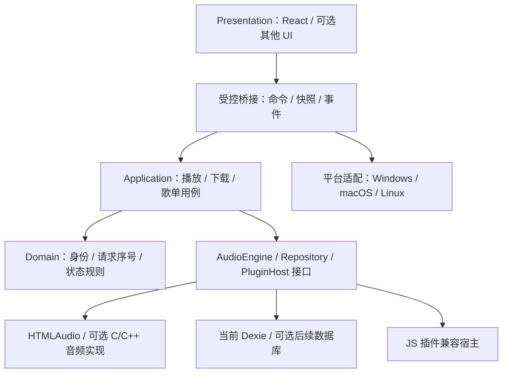

# 05 · Windows 架构与语言选型

[返回目录](README.md)

> 本章为后续选型参考。当前决定是第一阶段保留现有架构，先修复与验证；以下目录分层、进程拆分、音频引擎和数据库迁移均不属于第一阶段任务。

## 1. 是否有必要针对 Windows 重构？

**第一阶段无需先重构架构。** 切歌竞态、服务恢复、扫描回调和提交/通知可以先在当前模块内修复。保留现有调用链，补上请求序号、生命周期检查、资源清理和回归测试，随后测量剩余瓶颈。

后续是否重构 Windows 平台层或播放/任务架构，再由明确的能力需求与测量结果决定。使用另一语言仍需要相同的正确性设计。

是否全面改成 Windows 原生产品，取决于三个决定：是否放弃 macOS/Linux、是否要求专业音频输出、团队是否能长期维护新的 UI 和音频技术。当前仓库已经跨平台，因此“Windows 专用”应被视为未来产品选择。

## 2. 已有 Windows 能力与应补的平台层

| 能力 | 已有实现 | 后续可评估方向 |
| --- | --- | --- |
| 托盘、全局快捷键 | main/tray-manager、shared/short-cut | 统一生命周期与命令来源 |
| 任务栏缩略图控制 | thumb-bar-util 与 `.node` 模块 | Win32 句柄、架构、ABI 和窗口重建归属平台适配器 |
| 系统媒体信息 | HTMLAudio + Media Session | 验证完整媒体键/状态/进度；必要时增加原生 SMTC 适配 |
| 无边框窗口/桌面歌词 | window-manager、window-drag | DPI、焦点、穿透、置顶、多显示器等用专门适配器处理 |
| 便携模式 | main/index 的 portable 分支 | 数据目录统一查询，关于页可见，迁移与备份可诊断 |
| 音频设备选择 | HTMLAudio.setSinkId | 输出设备变化、默认设备迁移与恢复；原生输出按需求新增 |

SMTC 与任务栏缩略图控制是两套能力；不能以已有任务栏按钮证明完整系统控制已通过。Microsoft 文档提供状态、元数据、时间线和控制事件的集成方式。[SMTC 文档](https://learn.microsoft.com/en-us/windows/apps/develop/media-playback/system-media-transport-controls)

## 3. 四条路线的取舍

| 路线 | 保留什么 | 必须重做什么 | 适合的前提 | 主要风险 |
| --- | --- | --- | --- | --- |
| A：优化 Electron + TS/React | 界面、主题、插件协议、大部分业务 | 请求状态、后台任务归属、桥接、平台层、受支持运行时 | 希望连续迭代、保留现有生态 | Chromium 资源底座仍在；业务边界若不改变收益有限 |
| B：Electron 界面 + 原生音频侧核心 | A 的兼容性和 UI | AudioEngine 实现、控制协议、设备/缓冲/DSP | 需要更可靠后台播放或 WASAPI 等能力 | 多进程协议、原生库发布和调试成本 |
| C：Tauri + Rust + React | 可复用不少页面/样式与业务设计 | Electron API、Node 插件宿主、文件/网络桥接、IPC、系统适配 | 跨平台且愿意维护 Rust 与 WebView 差异 | 现有 JS 插件需要完整兼容层；WebView 与侧进程需计入资源 |
| D：C# + WinUI 3 + 可替换音频引擎 | 协议、数据模型、产品流程 | UI、宿主、业务实现、插件兼容、迁移、主题体系 | 明确只面向现代 Windows，重视原生交互 | 重写范围大；新 UI 不自动获得 gapless/DSP/插件兼容 |

**当前先保留现有 Electron/TS/React 实现，只做必要修复。** 表中的 A 也包含较大的职责调整，不能把整条路线当作第一阶段必须完成的任务。

结合维护者的 C/C++ 背景，若以后确实需要原生输出、解码或系统能力，可优先验证 B 中的小型 C/C++ 核心并保留界面和 JS 插件。D 需要学习新的 UI/业务技术，仅在确定 Windows 专用产品方向后作为候选；C 在有跨平台/Web UI 需求时评估。尚未选择全面重写方案。

依据：Tauri 允许 Web 前端结合 Rust，Windows 使用 WebView2；WinUI 3 提供 C#/C++ 与 XAML，官方支持 Windows 10 1809 及之后系统。[Tauri 架构](https://v2.tauri.app/start/)、[WebView 版本](https://v2.tauri.app/reference/webview-versions/)、[WinUI 3](https://learn.microsoft.com/en-us/windows/apps/winui/winui3/)

### 关于 C++ 与 Rust

- **C/C++** 是当前维护者最熟悉的语言，适合未来的原生适配器、音频核心和已有库集成。全 UI 改写仍涉及桌面 UI、JS 插件协议、跨平台发布与迁移；语言熟悉能降低学习成本，但不缩小需要重新验证的产品范围。
- **Rust** 适合下载、索引、解析和原生核心，但学习和 FFI/Windows API 集成仍有成本。将原生部分控制在清晰接口后比全仓库迁移容易验收。
- **C#** 适合 Windows 桌面应用与业务维护。它仍须处理异步竞态、UI 线程、资源生命周期和音频缓冲；不能把语言名称当作性能保证。

## 4. 后续可评估的目标架构



这是**后续方案图**，不代表仓库已按此改造。图中节点表示代码职责和接口关系，不是进程部署图；是否拆成进程需另行决定。Domain/Application 也不能简单全部放到 main 主线程。

### 职责划分

| 层 | 职责 | 禁止形成的依赖 |
| --- | --- | --- |
| Presentation | React 页面、歌词显示、选择/焦点、视觉插值 | 直接访问文件、执行插件、写数据库 |
| Application | Play/Pause、Download、MoveToSheet、ImportBackup 等用例 | 依赖具体页面、DOM 或 Win32 句柄 |
| Domain | 歌曲身份、队列规则、任务状态、请求序号、错误结果 | Electron、IndexedDB、HTMLAudio 的具体实现 |
| Infrastructure | Repository、下载网络、索引、音频引擎、插件宿主 | 反向调用任意 UI 逻辑 |
| Windows Adapter | SMTC、任务栏、窗口、设备、电源恢复、便携目录 | 把平台判断散布到歌单/下载用例 |

后续方案的示例目录（第一阶段保持原目录）：

```text
src/
  domain/            # media identity, playback session, download states
  application/       # use cases + ports
  presentation/      # React components and view models
  infrastructure/
    audio/            # HTMLAudioEngine / optional NativeAudioEngine
    storage/          # IndexedDB repositories / optional SQLite
    download/         # durable tasks + transport
    plugins/          # compatibility adapter + host protocol
  platform/          # windows / macos / linux adapters
    windows/          # taskbar, SMTC, windows, devices
  host/               # Electron composition + validated IPC
```

目录不是目标本身；验收依据是可替换实现、独立测试和明确状态归属。小型模块不必强行增加五层转发。

### 播放控制契约示例

```ts
interface AudioEngine {
  load(source: ResolvedSource, options: { requestId: number; signal: AbortSignal }): Promise<void>;
  play(): Promise<void>;
  pause(): void;
  seek(seconds: number): Promise<void>;
  selectDevice(deviceId: string): Promise<void>;
  dispose(): Promise<void>;
}
```

示例为后续设计契约，未新增代码。还需事件订阅/释放、快照、buffering/ended/error、能力枚举、音量/速度和预加载约定。当前已有 [IAudioController](../../src/types/audio-controller.d.ts)，后续评估时可从它入手；第一阶段不要求替换接口体系。

状态事件建议带 `requestId`、递增 `revision` 和结构化错误；跨进程只有歌曲键不足以区分快速重播。读取快照和订阅更新应有一致顺序，避免 UI 读到互相冲突的状态。

## 5. 后台播放与插件进程怎么安排？

### 音频

先用现有 HTMLAudioEngine 校准基线。若只是避免界面重建影响控制，可验证独立播放 renderer；它仍有浏览器进程成本。若需要专业音频能力，再验证原生音频侧进程或模块。Electron utilityProcess 提供 Node 子进程能力，但不是 HTMLAudio 播放环境。[utilityProcess API](https://www.electronjs.org/docs/latest/api/utility-process)

原生侧应负责解码、缓冲、设备输出和曲目调度；界面接收节流快照并本地插值。UI 卡顿时不能靠不断提高 IPC 频率补救。

### 插件

现有插件依赖 JavaScript、axios、cheerio、webdav、storage 和环境约定。Tauri 或 C# 不会自动提供相同 Node 环境。可选：

1. 保留受控 Node 插件宿主，尽量兼容现有接口。
2. 引入另一个 JS 运行时，但必须实现网络、包、异步、存储和用户变量兼容层。
3. 使用新插件协议并制作迁移工具，接受生态兼容成本。

普通子进程主要提供崩溃/阻塞隔离。它仍可能继承用户权限；真正的权限限制需要独立的权限设计和系统边界验证。插件宿主至少应支持超时、取消、终止、并发上限、响应 schema 校验和脱敏日志。

## 6. 音频能力的选型边界

| 候选 | 可以验证的方向 | 不能直接保证 |
| --- | --- | --- |
| Windows MediaPlayer / Media Foundation | 常见格式与 Windows 媒体控制集成 | 所有插件音源、gapless、特殊格式或独占输出都自动支持 |
| .NET 音频库，例如 NAudio | C# 下的设备与 WASAPI 等集成 | 完整播放器引擎、全格式解码和无缝调度已现成完成 |
| Rust/C++ 的原生音频核心 | 输出模式、缓冲、预解码、DSP 的可控性 | 低成本迁移、各设备天然稳定 |

WASAPI 有共享和独占模式，选择涉及设备占用和格式支持。NAudio 官方提供 .NET 音频基础能力，仍需构建播放器调度。[WASAPI](https://learn.microsoft.com/en-us/windows/win32/coreaudio/wasapi)、[NAudio](https://github.com/naudio/NAudio)

下载、播放和解码应共享“已解析音源”模型，明确 URL 有效期、认证 headers、代理、HLS 类型与取消能力；原生库的分发与授权约束应在选定依赖后核查。

## 7. 数据库要不要一起换 SQLite？

如果目标是长期后台任务、大型本地库和多宿主共用数据，SQLite + 单一写入服务值得验证。若只是修复当前 Bug，保留 Dexie 更容易保证兼容。现有 SQLite 备用代码不应直接启用成主库。

迁移至少包含：

1. 从当前业务 API 导出版本化 JSON；保留歌曲键、歌单次序、偏好、下载路径与歌词关联。
2. 对歌单引用重新计算，而非无条件沿用可能不一致的 `$$ref`。
3. 建立规范表：tracks、playlists、playlist_tracks、download_records、download_jobs、preferences、schema_migrations。
4. 在临时新库导入并核对数量、次序、关联与文件存在；成功后切换，不破坏原 profile。
5. 记录迁移版本与可回滚状态；对重复项、损坏备份、权限失败、磁盘满和旧便携目录测试。

## 8. 重写前的决策门槛

- A 路线优化后，在约定机器和数据规模上仍不能达到响应/资源目标。
- D 原型完成播放、HLS/headers、搜索插件、歌词窗口、系统控制和数据导入的关键链路。
- C 原型测量包括 WebView2、Node 插件宿主和音频侧进程的总资源。
- 新旧架构在同数据、同插件和同设备条件下比较，保留失败场景与迁移成本。
- 选定是否继续支持 legacy Windows；WinUI 3 不替代当前 Win7/8 分支。

满足这些条件后再决定长期路线，能够使语言/架构选择有实际证据。
