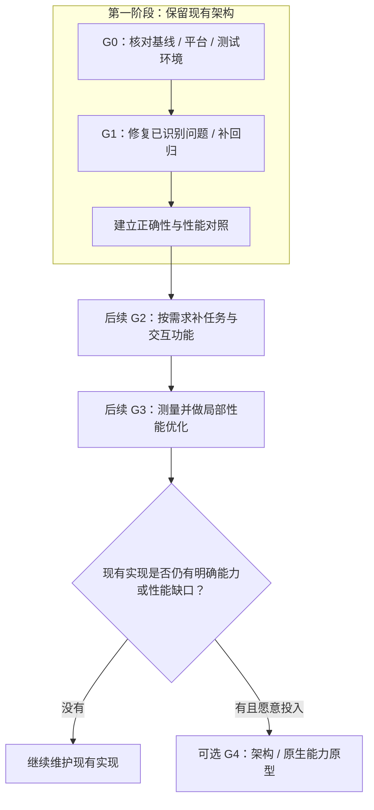

# 06 · 实施路线与性能验收

[返回目录](README.md)

## 1. 推进顺序



阶段表示先后依赖，不是已确定工期。建议以小范围、可回滚的提交推进，每阶段保留上一版本的数据兼容与核心回归。

**已确定的方向：第一阶段不重构。** 保持现有语言、框架、目录、进程布局和数据库，在原模块中完成必要修复与针对性回归。G2～G4 是后续候选，尤其 G4 没有启动承诺。

| 阶段 | 工作包 | 完成门槛 |
| --- | --- | --- |
| G0 · 第一阶段准备 | 核对构建与实际运行版本、三平台范围、独立测试目录；记录 SEC-01/02/03 的当前边界与升级需求 | 有可复现基线；清楚已验证与未验证的范围 |
| G1 · 第一阶段修复 | BUG-01～12 按下述任务卡分批处理；BUG-13 先识别并明确拒绝不支持的 HLS 下载 | 旧结果不影响新请求；服务/扫描正常；状态、文件、记录一致；已有下载回归通过 |
| G2 · 后续功能候选 | F-01/02/09/19 等按实际需求排序；优先沿用原模块 | 下载可取消/恢复；移动不丢引用；版本和运行路径可识别 |
| G3 · 后续响应与资源 | F-05/15/18；按测量处理 CODE-01～04、08，选取可以局部实施的改进 | 有基线与同场景改善证据；正确性不回退 |
| G4 · 可选架构/原生原型 | 单独决策分层、宿主、音频或数据库方案；先验证与 C/C++ 经验相符的小范围实现 | 兼容、迁移和维护成本可接受，资源与体验有实测收益 |

第一阶段中的接口修改仅服务于具体修复，如请求序号、watcher 回调顺序、错误结果或服务句柄清理；不以新增 Domain/Application/Repository 层为验收要求。

第一阶段 G1 的 BUG-01～13 已在 `dev` 修复，并补修 BUG-14；对应提交和 Windows 回归证据见 [04 状态表](04-code-audit.md)。当前架构保留。G1 的正确性验证已经完成，性能对照、全插件/设备兼容性和 Linux/macOS 实机验收仍应按各自范围开展。

### 本轮完成项

| 项目 | 状态与统一入口 | 下一步边界 |
| --- | --- | --- |
| 下载文件可用性同步（RISK-02） | 当前工作区已实现；文件事件、补偿核对、安全搬迁恢复、任务隔离和本地打开失败回退均有回归；见 [10](10-download-file-state.md) | 用户 Windows 手测；Linux/macOS GUI、实际外接盘/网络盘仍需平台实测 |

以下任务卡保留第一阶段的历史拆分；新增下载同步的机制与验收只维护第 10 章，避免在路线图重复设计正文。

SEC-01/02 的完整桥接与插件权限迁移仍需后续专门方案；SEC-03 需要运行时升级与兼容验证。此次修复没有完成这些迁移。

## 2. 建议的首批任务卡

1. **播放与歌词请求序号**：同时处理成功、失败、音质切换和 A → B → A；挂在 BUG-01/02。
2. **转发服务生命周期**：重启标志、backoff、host 清理、非法 URL、loopback 与会话授权；挂在 BUG-03/04。
3. **扫描握手与增量更新**：先接收后扫描；扩展名统一，处理 change；挂在 BUG-05/06/12。
4. **音源资源释放**：HLS、fetch 取消、Object URL、play 意图；挂在 BUG-07/08。
5. **提交/通知结果规范化**：Store 和 Repository 错误契约，事务内去重；挂在 BUG-09/10、CODE-09。
6. **可诊断启动**：当前启动链增加失败/重试反馈，避免 bootstrap 拒绝后无诊断首屏；挂在 BUG-11。完整构建标识页面 F-19 可另排后续功能。
7. **HLS 下载能力边界**：识别清单，明确拒绝尚未支持的完整歌曲下载；挂在 BUG-13。分片、加密、合并等完整支持 F-04 不属于首批任务。

每张卡都包含：重现输入、现状断言、修复断言、影响模块、失败分支、数据兼容和回滚方法。仓库现有的下载回归作为持续保护，修复不得使它退化。完成单项修复后把审阅脚本的“问题存在”断言转换为相应回归断言。

## 3. “更丝滑”的可测定义

以下为**建议验收目标，尚未测得，也不承诺所有设备都可达到**。先建立本机基线，再按最低支持设备调整。

| 指标 | 如何测量 | 建议目标/判定 |
| --- | --- | --- |
| 点击反馈 | 用户操作至视觉状态变化；本地操作和网络等待分开 | 本地反馈 P95 ≤ 100ms；网络任务立即显示进度 |
| 列表流畅度 | 60Hz 下滚动录制；统计长帧和主线程长任务 | 大多数帧 ≤ 16.7ms；长任务 >50ms 的来源可解释并减少 |
| 冷启动可交互 | 从启动 exe 到可以操作首屏；冷/热分开 | 首轮参考 P95 ≤ 3s；旧机器需依据基线校准 |
| 本地切歌 | 点击下一首至音频起声；固定本地文件 | P95 ≤ 200ms 作为原型目标；不等同无缝播放 |
| 网络切歌 | 获取 URL、首字节、缓冲、起声分别计时 | 比较 P50/P95，并按服务器/网络分类，禁止把服务器等待归为 UI 慢 |
| 长时内存 | 全部相关进程私有内存与 JS heap，稳定暖机后循环切歌 | 100次切歌/30分钟后不持续单向增长；若设增长阈值须解释缓存 |
| 空闲资源 | 默认主题、播放、歌词、扫描、下载分别测 CPU/内存 | 与自身基线比较；不规定未经实测的绝对 MB 数 |
| 歌词同步 | 音频时钟、当前行与桌面歌词显示偏差 | 参考 ≤100ms；后台和设备切换单独验证 |
| 下载一致性 | 成功任务、文件、下载记录、列表状态核对 | 所有测试任务一致；真实失败不报成功 |
| 无缝播放 | 拼接测试音频波形，识别额外静音/重叠 | 仅对支持的格式承诺；编码 padding 与播放调度分别验证 |

P95 指 95% 的样本不超过该值。16.7ms 对应 60Hz，120Hz 应用自己的帧预算。第一阶段只建立可复现基线与比较方法；这些后续目标不作为要求立即换架构的理由。隔离实验不提供以上性能数值。

## 4. 统一测试场景

| 场景 | 数据/操作 | 核心观察 |
| --- | --- | --- |
| 普通使用 | 100首，本地和一个稳定插件，默认主题 | 冷启动、搜索、播放、暂停、歌词 |
| 大音乐库 | 1万首/5万首元数据；单独记录封面规模 | 过滤、排序、全选、导入、扫描增删改、内存 |
| 下载压力 | 100个任务；并发 1/5/20 | 排队/传输/保存/取消/暂停；401/404/超时/磁盘失败 |
| 快速操作 | A → B、A → B → A，连续换音质和搜索 | 过时成功/错误不影响当前请求 |
| 混合源 | MP3/FLAC/HLS、URL 认证、headers、代理 | HLS 资源释放、Blob fallback、文件完整性 |
| Windows 行为 | 托盘隐藏、歌词/迷你、媒体键、多显示器/DPI | 状态一致、焦点、句柄、系统控制 |
| 设备与电源 | USB/蓝牙拔插、默认设备切换、睡眠/唤醒 | 自动恢复/错误提示；不将蓝牙固有延迟归为 UI |
| 异常数据 | 损坏备份、写入失败、重复歌曲、旧便携目录 | 原始库可恢复，失败回传准确 |

测试应使用独立数据目录和可控本地 HTTP/HLS 服务；不要在正常音乐库上做覆盖恢复、磁盘失败或大量删文件测试。

## 5. 工具与记录模板

- Electron/Chrome DevTools：Performance、React 重渲染、Heap Snapshot、网络时序。
- Windows 任务管理器/Performance Monitor：按进程记录 CPU、私有工作集与 I/O；复杂问题再用系统性能追踪。
- 主进程和 Worker 日志：请求序号、阶段耗时、任务/插件标识；认证 headers、URL 凭据和用户变量必须脱敏。
- 音频能力验证：固定测试文件、设备、采样率和输出模式；记录波形/回环测量条件，避免只凭听感给精确延迟。

建议记录字段：

```text
commit / build-id / executable-path
Windows version / CPU / RAM / storage / GPU / audio device
Electron or WebView / plugin set / theme / output mode
dataset size / cover size / cold-or-warm / network conditions
scenario / sample count / P50 / P95 / process memory / CPU
failure cases / trace files / comparison build / conclusion
```

Electron 官方建议先定位实际资源消耗，再持续优化。本计划的测量顺序与此一致。[性能指南](https://www.electronjs.org/docs/latest/tutorial/performance)

## 6. 后续若启动原型，如何决策

1. 以经过 G1～G3 修复的 Electron 版为对照，避免用仍有 Bug 的版本人为放大新架构收益。
2. 测量新方案的完整进程树；Tauri 的 WebView2、JS 插件宿主和音频侧进程都计入。
3. 核对在线插件、HLS、认证、桌面歌词、歌单次序、已下载路径与备份迁移。
4. 如果收益主要来自封面缓存/增量查询，优先把这部分改进带回现有架构。
5. 如果 Windows 原型在关键指标有稳定收益，且迁移/维护成本可接受，再决定是否建立原生产品分支。

## 7. 实施文档清单

| 阶段 | 应补的文档 | 用途 |
| --- | --- | --- |
| G0 | 三平台范围、实际构建/测试记录、现有权限边界、运行时升级待办 | 说明测试基线和仍待处理的风险 |
| G1 | 播放/歌词时序、扫描回调顺序、服务恢复、每项 Bug 的复现与回归记录 | 让现有实现的正确性可测试 |
| G2 | 下载任务 schema、歌单移动操作、构建标识；根据实施范围补接口说明 | 让新功能的状态与数据归属明确 |
| G3 | 性能基线、优化实验记录、封面缓存策略 | 证明收益并方便回归 |
| G4 | 架构决策记录、原型比较、数据迁移与回滚指南 | 支持语言/架构取舍 |

本知识库完成了仓库解释、产品清单、代码问题清单和路线评估。上表是未来实际开发阶段应补的设计与验收资料，不能误认为这些重构已实施。
