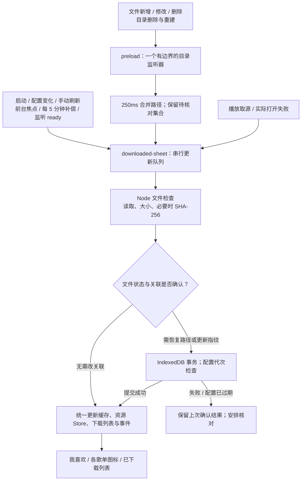
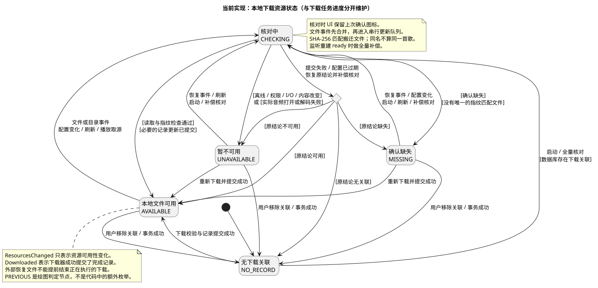
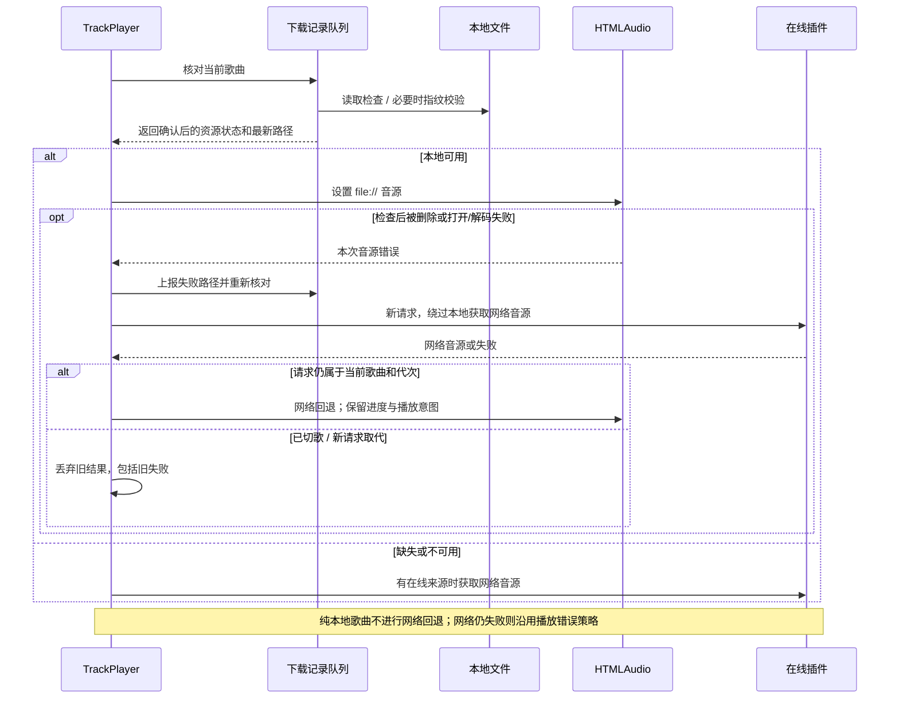
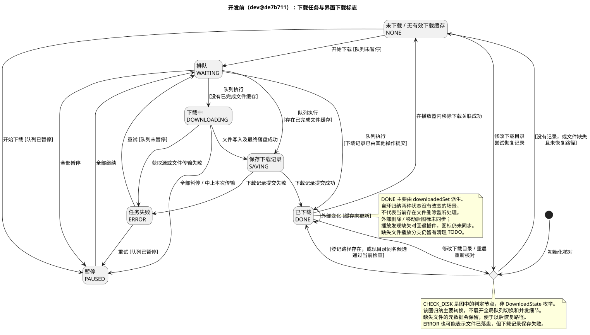

# 10 · 下载文件状态同步（当前实现）

[返回目录](README.md)

> 本轮已实现并验证，并按下载同步、播放恢复和启动优化分别提交到 `dev`。开发前基线为 `4e7b711`，旧状态保留在第 8 节；其他章节以本章为下载资源同步的统一说明。提交边界与验证见 [整理记录](../history/2026-10-05-functional-commits.md)。

## 1. 先看结果

| 你的操作 | 当前结果 |
| --- | --- |
| 在资源管理器里删除歌曲 | 自动核对；收藏和歌单中改为可下载，下载列表移除缺失项 |
| 删除整个下载目录，再恢复目录和歌曲 | 自动重新建立监听并核对，完整且身份匹配的歌曲恢复已下载图标 |
| 移动歌曲后修改下载目录 | 原路径缺失时，尝试当前目录中的同名候选；唯一且 SHA-256 匹配才恢复关联 |
| 外接盘离线、读取权限不足、I/O 故障 | 标记暂不可用，保留关联和收藏；图标显示原因，恢复后重新核对 |
| 正在下载时，外部恢复了原文件 | 本地资源可用，但不会提前结束正在执行的下载或移除暂停控制 |
| 不确定是否已更新 | 下载管理页点击“刷新本地文件状态” |
| 播放时本地文件可用 | 音频本地优先；歌词、封面等仍可能联网 |
| 检查后文件被删除，实际打开失败 | 更新资源状态；在线歌曲尝试一次网络回退，保留进度和播放/暂停意图 |

**两个生命周期分别维护：** `DownloadState` 管一次下载任务；`DownloadResourceState` 管当前本地文件是否可用。任务提交成功，不保证文件以后永远存在。

## 2. 同步链路



监听回调只报变化，实际文件核对后才发布结论。可以类比嵌入式中的“事件通知 → 工作队列 → 状态读回 → 发布状态”。

## 3. 当前资源状态机



| 状态 | 判定与表现 |
| --- | --- |
| `NO_RECORD` | 没有下载关联；可下载 |
| `CHECKING` | 正在核对；图标保留上次确认结果，避免闪动 |
| `AVAILABLE` | 文件可读取且通过大小/必要的内容校验；显示已下载，本地优先 |
| `MISSING` | 确认文件或目录缺失，没有可靠的搬迁候选；显示可下载，保留恢复元数据 |
| `UNAVAILABLE` | 离线、权限、I/O、空文件、内容变化，或本次打开/解码失败；保留关联，显示原因 |

`PREVIOUS` 是图中的判定节点，不是代码枚举。提交失败或配置变更时恢复上次确认结果；不会把未提交的路径当作新结论。

### 任务事件与资源事件

| 事件/数据 | 表示什么 | 能否结束下载任务 |
| --- | --- | --- |
| `DownloadEvts.Downloaded` | 下载器已成功提交完成记录 | 可以 |
| `DownloadEvts.ResourcesChanged` | 文件核对后资源恢复可用或路径变化 | 不可以 |
| `DownloadEvts.RemoveDownload` | 当前可用集合中的记录被移除 | 不表示正在执行的传输已取消 |
| `downloadedSet` | 当前 `AVAILABLE` 的歌曲键集合 | 不单独决定活动任务的进度 |
| 资源 Store | 所有已知关联的状态，包括缺失/不可用 | 供图标与本地播放选择使用 |

下载中页面优先显示实际任务进度；歌单中的下载图标读取资源可用性。外部恢复文件不会把尚未完成的传输误报为 `DONE`。

## 4. 本地优先与打开失败回退



实际打开失败只尝试一次本地→网络回退；重复错误不会重复启动恢复。恢复期间用户暂停，网络源准备好后保持暂停。`playback` 表示本次音频打开或解码失败；手动刷新会重新检查文件，文件检查不等于所有编码都能解码。

## 5. 实现机制与代码入口

| 模块 | 职责 | 重要边界 |
| --- | --- | --- |
| [download-resource.ts](../../src/common/download-resource.ts) | 资源枚举、文件身份、核对结果与事件类型 | 类型与下载任务枚举分开 |
| [download-file-system.ts](../../src/common/download-file-system.ts) | 文件读回、SHA-256、缺失/离线/访问错误分类 | 文件内容变化不覆盖原指纹 |
| [download-directory-watcher.ts](../../src/common/download-directory-watcher.ts) | Chokidar 监听、合并事件、重建监听、释放资源 | 只允许相关目录树；附近父目录失效后重新选监听位置 |
| [utils/preload.ts](../../src/shared/utils/preload.ts) | 将 Node 检查和监听能力通过 contextBridge 提供给 renderer | 窗口卸载关闭原生监听器 |
| [downloaded-sheet.ts](../../src/renderer/core/downloader/downloaded-sheet.ts) | 统一核对、串行事务、缓存、Store、补偿与配置代次 | 下载完成提交和核对共用队列 |
| [downloader/index.ts](../../src/renderer/core/downloader/index.ts) | 任务进度、真正完成事件、刷新和资源 hook | 资源恢复不提前结束活动任务 |
| [track-player/index.ts](../../src/renderer/core/track-player/index.ts) | 本地优先、打开错误回退、旧请求保护 | 失败路径已被新下载替换时，旧失败不能覆盖它 |
| [MusicDownloaded](../../src/renderer/components/MusicDownloaded/index.tsx) / [DownloadView](../../src/renderer/pages/main-page/views/download-view/index.tsx) | 下载图标、不可用原因、手动刷新 | 英文、简体中文、繁体中文均有对应文案 |

### 参数与恢复策略

| 机制 | 当前设置 |
| --- | --- |
| 文件事件合并 | preload 250ms 收集；renderer 250ms 合并/排队；持续变化不会无限延迟已收集事件 |
| 目录删除后的监听重建 | 500ms 后重新选择可访问监听位置；`ready` 触发全量核对 |
| 监听错误恢复 | 5 秒后重新建立监听；同时请求核对 |
| 核对/提交失败重试 | 自动核对失败时 5 秒后重试；手动刷新显示错误 |
| 补偿核对 | 启动时在首屏后分批执行，详见 [02](02-flows-and-development.md)；配置变化、手动刷新、监听 ready；每 5 分钟一次；焦点触发最多每 30 秒一次 |
| 磁盘/内容检查并发 | 普通候选分批最多 4 个；搬迁候选串行验证 |
| 指纹 | 大小、SHA-256、修改时间、设备提示；新下载建立，旧记录在文件可读取时补建 |
| 日常读取 | 指纹已有且大小/修改时间未变时做读取检查；文件事件、手动刷新、搬迁候选需要内容校验 |
| 缺失与不可用 | 保留歌曲身份、收藏、引用计数和下载路径元数据 |
| 已下载页面 | 显示可用与暂不可用的关联；确认缺失项移出列表，元数据仍保留 |

## 6. 已解决问题与验证证据

| 问题 | 本轮结果 | 验证方式 |
| --- | --- | --- |
| 外部删除后图标仍是已下载 | 已修正 | Windows 真实 Chokidar、IndexedDB、已挂载 React 图标 |
| 整个目录删除/重建不刷新 | 已修正 | Windows 用户临时目录和 F 盘测试；Linux 原生文件事件与重新附着 |
| 同名歌曲误恢复下载关联 | 已防止 | 同名、同大小、不同 SHA-256 的候选拒绝关联 |
| 外接盘或访问故障被当作删除 | 分类保留关联 | 注入离线、权限、I/O 错误；检查警告图标和引用计数 |
| 文件检查后被删除，播放不能自愈 | 已修正 | 真实 HTMLAudio 在打开前删除本地 WAV，再验证网络 WAV 解码播放 |
| 恢复请求晚到覆盖新歌曲 | 已防止 | Node 的延迟成功/失败、暂停、切歌及重复错误回归 |
| 旧目录核对覆盖新设置 | 已防止 | 核对途中切换目录；检查事务、缓存与事件没有发布旧路径 |
| 核对提交失败丢失原路径 | 保留原记录与原结论 | 注入真实 IndexedDB 写失败，恢复后重新核对 |
| 恢复文件提前结束正在下载的任务 | 已防止 | 真实下载队列中阻塞取源，恢复旧文件；任务保持下载中，真正提交后才完成 |

[本轮验收记录](evidence/download-file-sync-results.json)包含环境、源文件校验值与测试结果；[回归入口](../../scripts/tests/README.md)说明如何复跑。Node 8 组、Windows Electron 6 组、类型与格式门禁已通过。Linux 本轮验证了文件检查和原生监听；没有把它当作 Linux GUI 或 macOS 运行验收。

Windows 编译版还用独立 profile 检查了真实打包 preload 的 contextBridge：文件 SHA-256、原生删除回调、目录删除/恢复和停止释放均通过。知识库离线网页 12 张图在桌面、窄屏与打印模式均渲染成功；对应结果见 [网页验证记录](evidence/browser-render-results.json)。

## 7. 保留的边界

| 场景 | 当前边界与处理 |
| --- | --- |
| 旧记录没有指纹，升级前已搬离原路径 | 无法仅凭同名证明身份；原路径重新可读时可补建指纹，之后支持可靠搬迁恢复 |
| 文件被移动并改名，或移到未知目录 | 不扫描整个磁盘；当前仅检查已登记路径与配置目录中的同名候选 |
| 正在写入的临时文件 | 没有已提交下载关联，不作为完成歌曲导入 |
| 外部编辑音频标签或内容 | 指纹变化标记不可用；保留原身份，用户可恢复原文件或重新下载 |
| 目录或卷不可访问 | 区分确认缺失与暂不可用；设备提示辅助判断，网络盘和特殊挂载仍需额外设备验证 |
| 下载任务持久化、Range 续传、单任务取消、HLS 合并 | 本轮没有新增，继续在 [03](03-product-improvements.md) 管理 |

## 8. 历史状态机（开发前）

以下只表示 `dev@4e7b711` 的开发前行为：下载图标来自内存缓存，外部删除没有持续同步，播放取源缺失分支有清理 TODO。不能把此图当作当前实现。



`CHECK_DISK` 是原图中的判定节点，不是枚举。一次任务 `ERROR` 也可能是文件已落盘、记录保存失败；这仍是理解任务状态与资源状态区别的重要例子。当前任务流程见 [02](02-flows-and-development.md)。

## 9. 维护方式

正文仅维护本章。`docs/design/download-file-state/README.md` 只保留入口；`implemented.puml` 与 `before.puml` 是图的唯一源码。网页生成器自动嵌入 SVG 和对应源码，并检查 SHA-256，避免图与源码不同步。

```powershell
python docs/knowledge-base/evidence/render-plantuml.py --jar C:/tools/plantuml.jar --dot C:/tools/Graphviz/bin/dot.exe
python docs/knowledge-base/evidence/build-docs.py
.\node_modules\.bin\electron.cmd docs/knowledge-base/evidence/browser-render-test.cjs
```

只修改文字或 Mermaid 时跳过第一条。图形在本地生成，浏览器读取离线 SVG；源码可展开，较大的状态图可点击“打开大图”。
