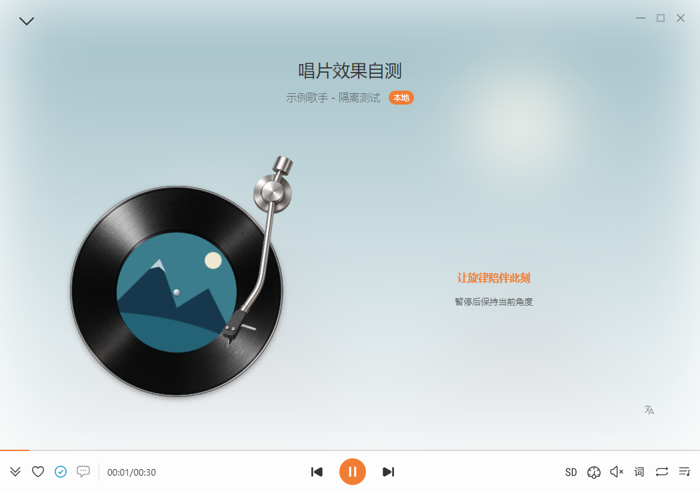
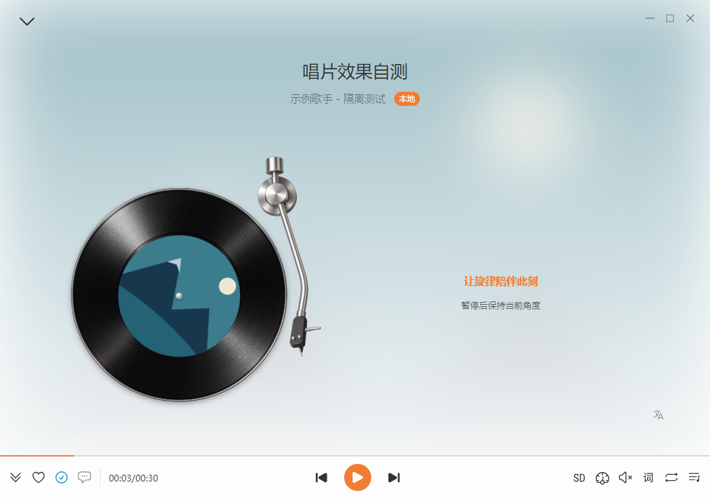
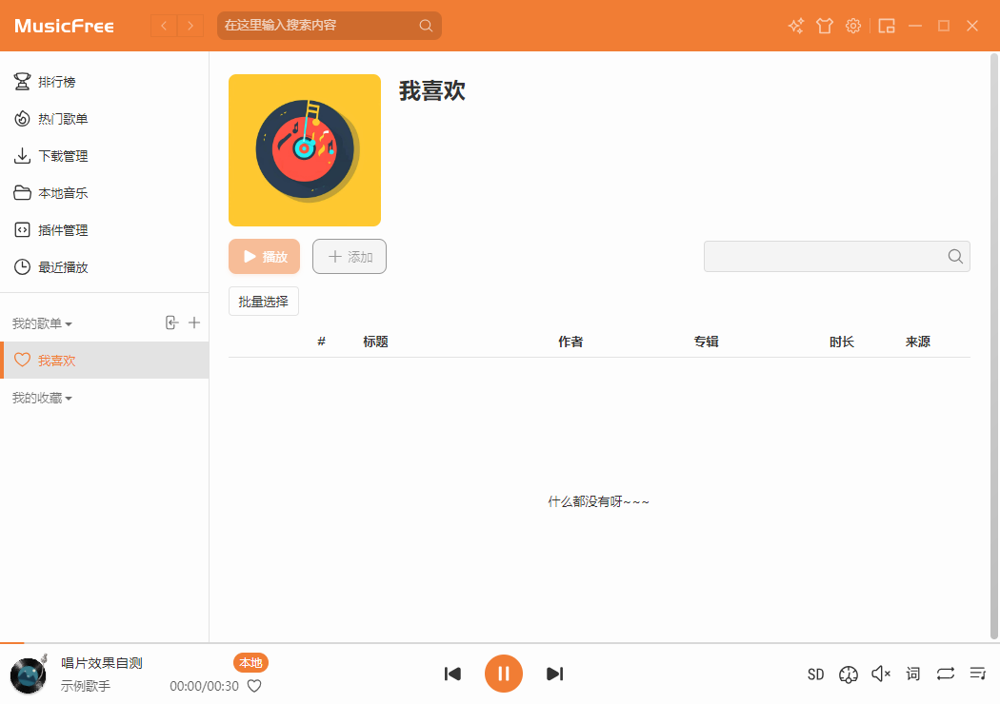
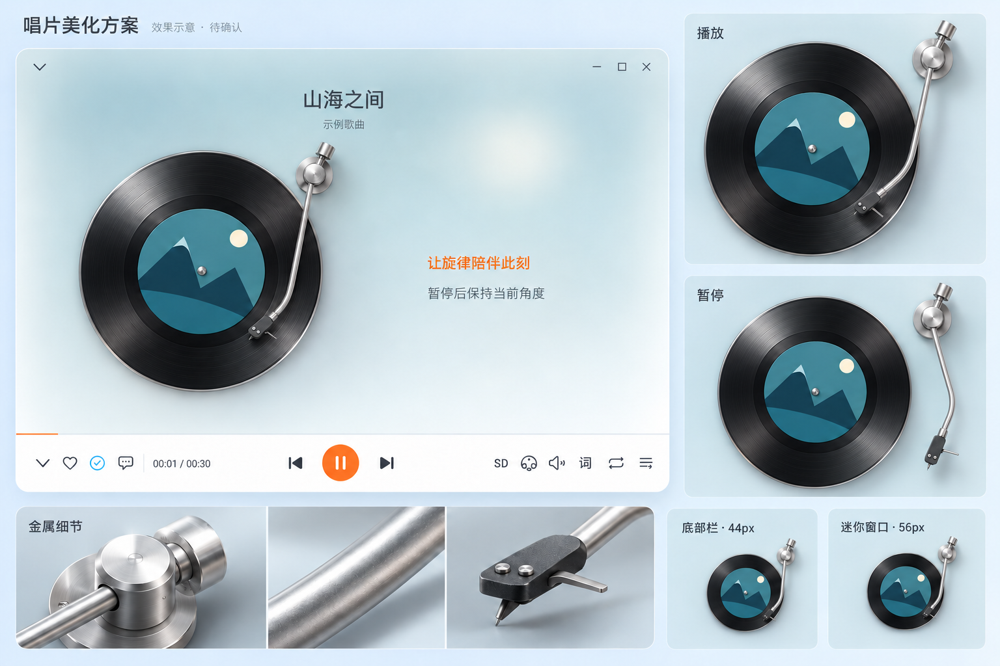

# 11 · 唱片播放效果：写实金属材质

[返回目录](README.md)

> 状态：**已改用写实唱臂与黑胶素材，已接入播放器并通过 Windows 自测和编译。** 本章前半部分是编译版真实截图；第 6 节保留确认的 AI 示意图，便于对照。验证使用独立 profile 和示例歌曲，用户音乐库与设置不参与。**2026-10-05：用户已验收本轮写实效果。**

**新的整体配色提案：** 见 [12 江南 · 青花主题预览](12-jiangnan-porcelain-theme.md)，目前只提供效果图，待确认后开发。

## 1. 当前详情：实际截图

[打开播放详情原尺寸截图](assets/previews/vinyl-real-detail-playing.png)。暂停后唱臂移到盘外，唱片保留当前角度：

截图是静态图片。运行本轮编译版可以查看旋转和唱臂过渡；隐藏测试窗口的截图用于确认外观姿态，真实 Chromium 动画行为另由组件回归验证。

## 2. 三个显示位置

| 位置 | 当前样式 | 适配 |
| --- | --- | --- |
| 歌曲详情 | 写实银色弧线唱臂、底座、配重、螺丝与石墨唱头 | 唱片展示区域略放大；尺寸取 `min(51vmin, 40vw)`，唱针落在黑胶右下外圈 |
| 底部栏 | 共用写实素材，减小阴影 | 封面组件 44px；保留点击和键盘打开详情 |
| 迷你窗口 | 共用写实素材，减小阴影 | 封面 56px，窗口 340 × 72；保留歌词、拖动、双击和悬停操作 |

迷你窗口原尺寸截图：

详情打开时，底部栏继续按既有规则切换为歌曲操作按钮，隐藏的底部封面停止旋转。

## 3. 材质与几何

之前两轮使用 SVG 渐变模拟金属，实际画面中的高光、厚度与表面细节仍与确认图有明显差距。本轮改为使用确认图作为参考生成写实透明素材，并直接接入播放器。唱片槽纹与反光也一起重做；专辑封面直径从唱片的 64% 调整到 54%，使黑胶区域更接近参考比例。

| 部位 | 当前实现 |
| --- | --- |
| 金属管 | 本地透明 PNG，包含圆柱反射、窄高光、暗面和细表面纹理 |
| 底座与配重 | 同一素材中的车削端面、倒角、圆柱侧面与接触阴影 |
| 唱头 | 石墨材质、真实厚度、两枚螺丝、金属提手和针尖 |
| 黑胶 | 本地透明盘面素材，包含细密槽纹、银色边缘与固定方向的反光 |
| 封面 | 歌曲实际封面，圆形裁剪后旋转；直径占唱片 54% |
| 层次 | 盘面在下，歌曲封面与中心轴居中，唱臂在上；盘面反光保持固定 |

唱臂围绕 `(82, 16)` 转动，素材中的针尖映射到播放位置 `(64, 78)`；暂停转到 `-25°`。这些坐标以封面组件的 `100 × 100` 视图为单位。播放针尖位于黑胶右下外圈，暂停针尖在盘外。测试使用素材实际 alpha 边界与可见针尖检查位置，避免只验证空的矩形或替代路径。

素材通过内置 **imagegen** 生成后原样复制到仓库：

- [写实唱臂 PNG](../../src/assets/imgs/vinyl-tonearm-real-v1.png)：1024 × 1536，约 1.2MiB。
- [写实黑胶 PNG](../../src/assets/imgs/vinyl-record-real-v1.png)：1254 × 1254，约 2.1MiB。
- [生成提示词与参考图说明](evidence/vinyl-real-prompts.txt)。素材使用真实透明通道，背景没有烘焙进图片。

素材随应用打包，通过本地地址加载；光照和表面细节已在素材内绘制，运行时对封面和唱臂执行 CSS 旋转。主窗口与迷你窗口都使用这两份素材。小尺寸保留相同造型，减小阴影，避免 44px / 56px 下发糊。

## 4. 状态规则

| 状态 | 唱片 | 唱臂 |
| --- | --- | --- |
| 播放 | 20 秒一圈匀速旋转 | 落到黑胶外圈 |
| 暂停 | 保持当前角度 | 转到右侧盘外 |
| 继续播放 | 从暂停角度继续 | 再次落下 |
| 缓冲、无歌曲 | 停转 | 移开 |
| 窗口或封面隐藏 | 暂停动画，可见后按播放状态继续 | 保留与播放状态对应的姿态 |
| 系统减少动态效果 | 不自动旋转 | 直接切换姿态，无过渡 |

切歌重新建立唱片；暂停和继续保留同一首歌的唱片节点与动画角度。唱臂转动围绕固定支点进行，过渡为 450ms。

## 5. 实现、验证与运行

共用 [VinylCover](../../src/renderer/components/VinylCover/index.tsx)和 [SCSS](../../src/renderer/components/VinylCover/index.scss)。主窗口使用播放状态 Store，迷你窗口由 MessagePort 消息总线同步；详情、底部栏和迷你窗口继续共用一个实现。`compact` 控制小尺寸阴影。

| 验证 | 结果与范围 |
| --- | --- |
| 唱针几何 | 三处播放针尖位于外圈、暂停针尖移出唱片，素材实际可见边界不越界 |
| 图形与动画 | 两份素材在实际 Chromium 中解码且背景透明；反光无旋转动画；20 秒周期、暂停保持角度、继续、切歌、隐藏停转和减少动态效果通过 |
| 交互与生命周期 | 封面失败回退、键盘打开详情、迷你双击/悬停、卸载订阅清理通过 |
| 编译版 | 真实 main / preload / renderer，本地 WAV 播放、详情与迷你窗口状态同步及暂停通过 |
| 门禁 | 本轮 Windows 唱片组件回归、TypeScript 和全库格式检查通过；下载与音频业务代码未改动 |
| 启动 | 使用 1000 条隔离记录再测，首屏仍不等待后台文件核对，详见验证记录 |
| 知识库 | 本轮实际截图和所有流程图在离线网页、窄屏及打印模式验证通过 |

[本轮验证记录](evidence/vinyl-real-results.json) · [测试说明](../../scripts/tests/README.md) · [启动优化流程](02-flows-and-development.md)。Linux/macOS GUI、不同 DPI 与长期性能仍需设备验收。

先退出旧播放器，再运行 `out/vinyl-real-20261005/MusicFree-win32-x64/MusicFree.exe`。查看详情、底部栏及迷你窗口，检查播放/暂停/继续、切歌与最小化恢复。系统启用了减少动态效果时，不自动旋转是预期行为。

## 6. 已确认示意图与设计参考

[打开确认图原尺寸](assets/previews/vinyl-beauty-silver-v2.png)。此图由内置 imagegen 生成，图中“待确认”是生成时的状态，现在已经确认并实施；它仍是视觉参考，不是程序截图。44px / 56px 两张小图是放大的适配示意。

你的参考图：[运行](assets/previews/vinyl-reference-playing.png)、[暂停](assets/previews/vinyl-reference-paused.png)，原样来自 `docs/ref`。主要借鉴细长金属管、配重、轴承与窄高光的层次。

网上查阅的设计依据：

- [网易云音乐设计团队：播放器样式创新设计（站酷）](https://www.zcool.com.cn/article/ZMTYyNjY4MA==.html)：将合理实体结构、材质与光影融入播放器设计。
- [Technics SL-1200GR2 官方说明](https://www.technics.com/au/products/turntables/sl-1200gr2ebs.html)：以 S 形铝合金唱臂与轴承结构作为金属形态参考。

[生成与修订提示词](evidence/vinyl-beauty-prompt.txt) · [示意图生成和当时的网页验证记录](evidence/vinyl-beauty-results.json)。实现与运行验收由第 5 节记录维护。

## 7. 历史效果

上一轮增强 SVG 金属反射：[详情播放](assets/previews/vinyl-metal-detail-playing.png)、[详情暂停](assets/previews/vinyl-metal-detail-paused.png)。该版材质表现仍未满足确认图的效果，已由当前写实素材实现取代；[当时验证记录](evidence/vinyl-metal-results.json)保留。

上一版银色唱臂：[详情播放](assets/previews/vinyl-silver-detail-playing.png)、[详情暂停](assets/previews/vinyl-silver-detail-paused.png)。该版形态接近参考，但金属反射不足，已由本章的新实现取代；[当时验证记录](evidence/vinyl-silver-results.json)保留。

第一版实际截图：[详情播放](assets/previews/vinyl-detail-playing.png)、[详情暂停](assets/previews/vinyl-detail-paused.png)、[底部栏](assets/previews/vinyl-bottom-playing.png)、[迷你播放](assets/previews/vinyl-mini-playing.png)、[迷你暂停](assets/previews/vinyl-mini-paused.png)。原实现与验证记录保存在 [第一版记录](evidence/vinyl-player-results.json)。

[最初开发前示意图](assets/previews/vinyl-player-concept.png)保留供历史对照。全部图片随知识库保存，可离线查看；当前效果以第 1、2 节实际截图和本轮运行版为准。
