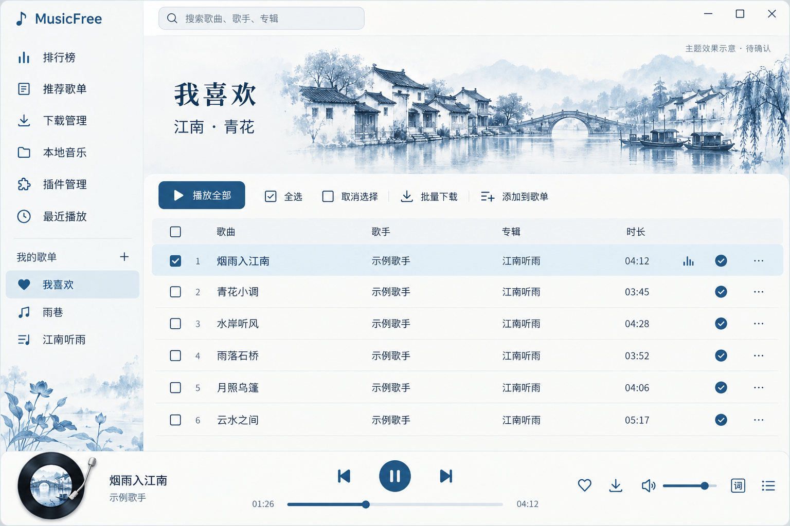
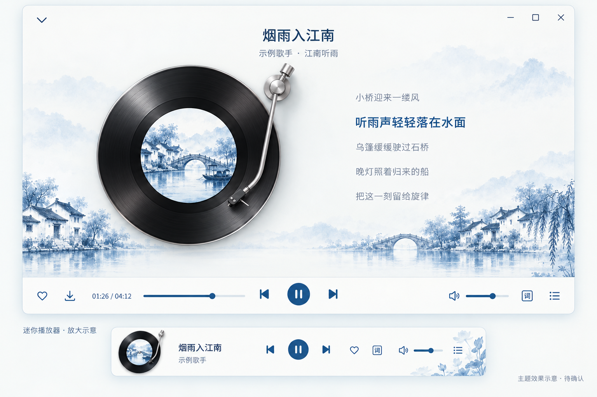

# 12 · 江南 · 青花：播放器主题效果预览

[返回目录](README.md) · [当前唱片实现](11-vinyl-player-preview.md)

> 状态：**视觉方向已确认，主题已合入 `dev`。** 本章保留开发前由内置 imagegen 生成的提案图，不是播放器运行截图。[13 青花主题实际预览](13-jiangnan-theme-implementation.md)展示真实编译页面与验证。

## 1. 主界面：瓷白底，青花蓝，烟雨江南

[打开主界面原尺寸效果图](assets/previews/jiangnan-porcelain-main-v1.png)

主界面以「我喜欢」歌单为例：左侧保留导航和歌单，右侧保留歌曲列表、复选框与批量操作。江南水乡插画集中在歌单头部，青花纹样只点缀边角；列表区域留白，让歌曲信息容易阅读。主按钮与播放进度统一使用青花蓝。

## 2. 歌曲详情与迷你播放器

[打开详情与迷你播放器原尺寸效果图](assets/previews/jiangnan-porcelain-detail-mini-v1.png)

详情页延续左侧唱片、右侧歌词的布局，以淡蓝烟雨背景和瓷白留白衬托唱片。当前歌词使用青花蓝，其他歌词使用可读的墨灰；不把青花纹样铺在歌词下面。底部栏和迷你窗口保持相同配色，小尺寸只保留主要轮廓。

效果图使用统一的水乡示例封面来展示整体氛围。**实际开发时仍显示歌曲自己的专辑封面，不会把所有封面都替换成青花图。** 迷你窗口在图中为放大示意，实际需要按现有小窗口尺寸适配。

## 3. 视觉约定

| 元素 | 拟采用的设计 | 目的 |
| --- | --- | --- |
| 页面底色 | 瓷白 `#F7F8F4` | 柔和、干净，避免整页灰青色模糊背景 |
| 内容表面 | 白色 `#FFFFFF` | 歌曲列表和文字有明确的阅读区域 |
| 主色 | 青花蓝 `#245A81` | 主按钮、播放进度、当前歌词、选中状态统一 |
| 选中背景 | 淡青蓝 `#E8F0F4` | 与未选中行区分，兼顾复选框与键盘焦点 |
| 正文 | 墨色 `#253A47` | 小字号歌曲信息也要清晰 |
| 装饰 | 水乡、石桥、乌篷与少量青花枝叶 | 表现江南意境，集中在留白处 |
| 字体 | 现有系统无衬线字体 | 导航、列表和歌词不使用难读的书法字体 |
| 唱片 | 黑胶盘、原专辑圆形封面、银色唱臂 | 黑胶与青花蓝形成层次；金属保持窄高光与暗面 |

颜色是拟议主题参数，图片的具体像素会有生成偏差；开发时以确认后的参数和实际页面为准。图片中的歌曲、时长和歌词均为视觉示例。

## 4. 确认后的开发范围

| 区域 | 计划调整 | 验收重点 |
| --- | --- | --- |
| 主窗口 | 主题颜色、边框、导航、歌单头部装饰和列表状态 | 选中、悬停、键盘焦点、下载状态清楚；批量按钮保持易用 |
| 歌曲详情 | 背景、歌词颜色、唱片周边层次 | 任意专辑封面都协调；文字不被装饰干扰 |
| 底部播放栏 | 进度、播放按钮、文字与图标配色 | 小尺寸清晰，播放操作位置稳定 |
| 迷你窗口 | 同一配色、精简纹样与圆形唱片 | 拖动、悬停、歌词、双击等交互仍正常 |
| 金属唱臂 | 与新配色协调，保留清楚的反射层次 | 对照真实程序截图验收材质与光感，不能只用效果图代表完成 |
| 启动与动画 | 装饰作为本地静态资源；旋转继续使用现有动画机制 | 不引入启动网络请求、运行时生成图片或持续 3D 渲染 |

青花瓷主要体现为配色、留白和局部纹样；瓷器表面与金属的图像质感需要分别处理。上表保留开发前范围，当前实际效果与启动记录见 [13](13-jiangnan-theme-implementation.md)。

## 5. 本轮交付与维护

- 本地图片保存在 `assets/previews`，随知识库一起复制即可离线查看。
- 生成方式：内置 imagegen，两个独立效果图；[完整提示词](evidence/jiangnan-porcelain-prompts.txt)记录颜色、布局和约束。
- [预览验证记录](evidence/jiangnan-porcelain-preview-results.json)记录图片校验值、网页显示检查及本轮范围。
- 当前真实截图与实施验证统一收录在 [13](13-jiangnan-theme-implementation.md)；本章仅维护提案图。

使用浏览器打开 `index.html`，选择左侧「12 江南 · 青花主题预览」。也可以直接使用 `index.html#jiangnan-porcelain-theme` 定位本章。无需安装工具或启动服务。
