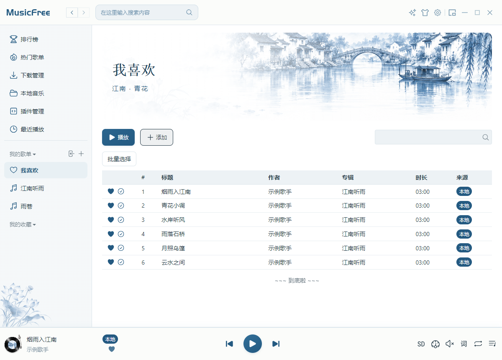
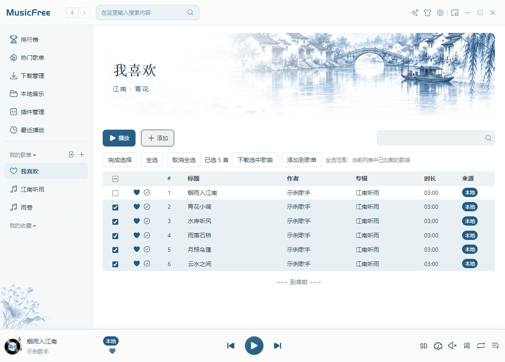
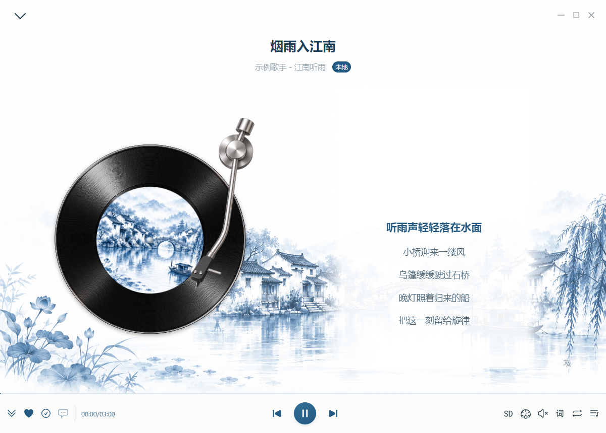
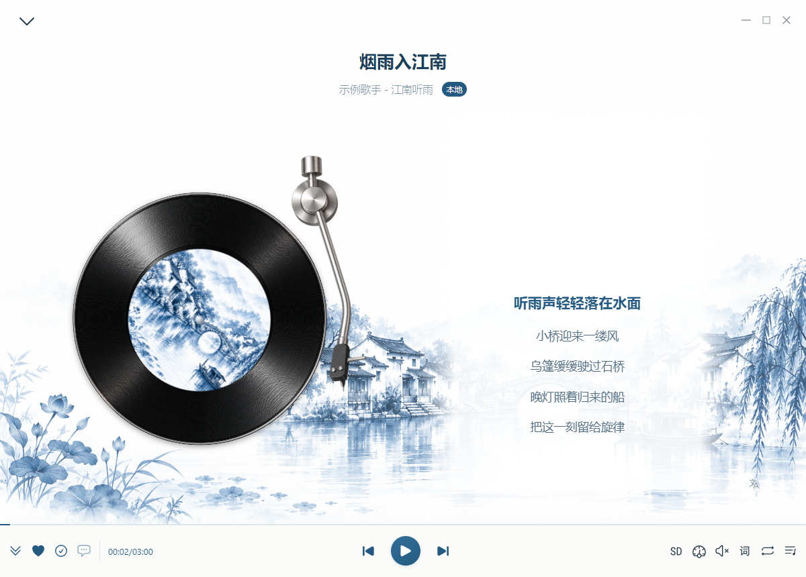
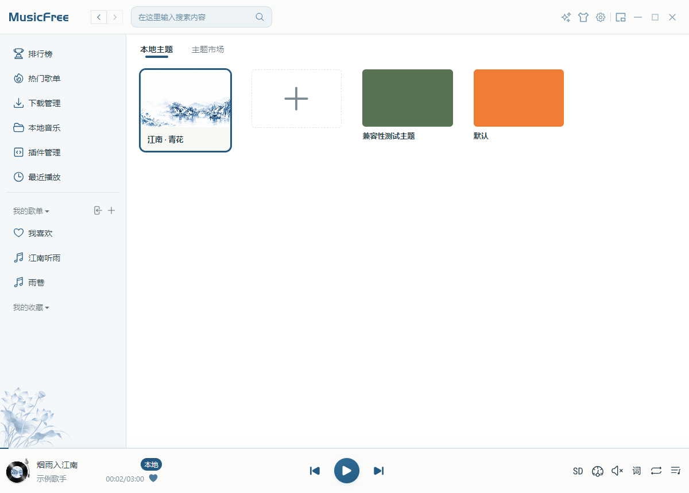
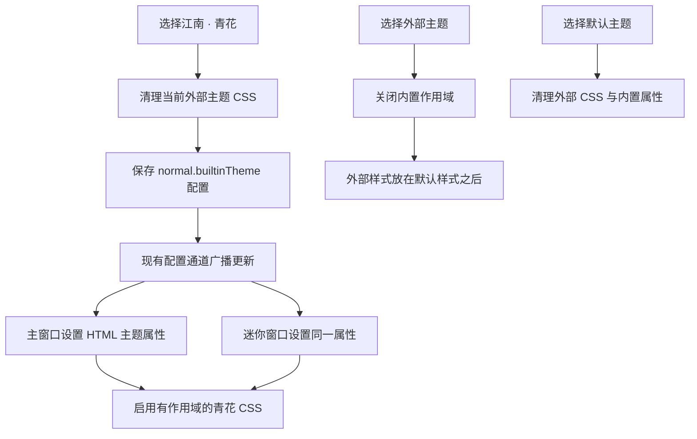
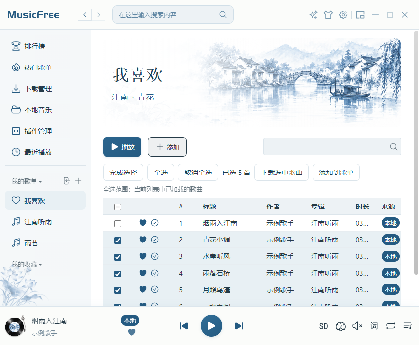

# 13 · 江南 · 青花：主题实现与运行验证

[返回目录](README.md) · [开发前效果图](12-jiangnan-porcelain-theme.md)

> 本章展示**Windows 编译版的实际截图**。主题在 `preview/jiangnan-porcelain` worktree 中独立开发，现已合入 `dev`。外部主题样式优先级修复与青花主题分别提交；当前分支既有的下载同步、启动优化和写实唱片代码一并保留。

## 1. 主界面与批量选择

[打开主界面原尺寸截图](assets/previews/jiangnan-actual-main.png)

主窗口使用青花蓝按钮、淡蓝选中行和瓷白阅读区域。江南插画位于歌单头部，荷花点缀侧栏底部。歌曲自己的封面仍会显示；没有设置歌单封面时，水乡背景作为头部装饰。字号和文字使用系统字体，表格仍保留原来的行高，避免影响虚拟滚动。

## 2. 唱片详情与迷你窗口

[打开详情原尺寸截图](assets/previews/jiangnan-actual-detail-playing.png)

当前歌词使用青花蓝，其他歌词使用墨灰。唱片展示尺寸在此主题中放大为 `min(52vmin, 42vw)`，唱片内部几何和播放状态逻辑沿用当前分支的写实唱片实现；隐藏与减少动态效果规则保持有效。

迷你窗口仍是 340 × 72，封面仍为 56px；正常显示歌词，悬停显示操作按钮。它采用适合真实尺寸的精简布局，开发前效果图中的放大迷你示意没有照搬为更大的窗口。

## 3. 切换主题与同步

点击顶栏衣服图标进入主题页，在「本地」选择「江南 · 青花」。选择「默认」可恢复经典样式。当前版本默认启用青花；配置会保存，主窗口与已经打开的迷你窗口会一起更新。选择外部主题时，会取消内置青花作用域，交还颜色与样式控制。

外部主题验证中发现既有样式节点可能排在打包默认样式之前，导致同级 CSS 被覆盖。本轮在主题 preload 中将选中主题的样式节点移动到末尾，验证了覆盖优先级与重新加载后的恢复。

## 4. 代码范围

| 位置 | 作用 |
| --- | --- |
| `src/shared/themepack/builtin.ts` | 读取配置、设置主题属性、订阅配置更新；每个渲染窗口只绑定一次 |
| `src/shared/themepack/jiangnan.scss` | 配色、主窗口、歌单、详情、底部栏、迷你窗口与窄屏样式 |
| `src/shared/themepack/renderer.ts` | 内置与外部主题互斥选择，保留原主题包接口 |
| `src/shared/themepack/preload.ts` | 确保选中的外部主题在默认 CSS 之后 |
| `src/renderer-minimode/document/bootstrap.ts` | 配置准备后启用同一主题绑定 |
| `src/assets/imgs/themes` | 本地水乡与透明荷花 PNG 素材 |
| `src/types/app-config.d.ts` 与默认配置 | 增加内置主题选择项 |
| `src/renderer/components/MusicFavorite/index.tsx` | 收藏颜色读取主题变量，经典样式回退原来的红色 |
| 歌单 Header 与 LocalThemes | 歌单封面判断和青花主题选择入口 |

主题只在 HTML 的 `data-builtin-theme="jiangnan"` 属性存在时生效。没有在线素材、运行时生成图片、水面动画或 3D 引擎。背景与荷花使用内置 imagegen 生成，[水乡提示词](evidence/jiangnan-water-town-prompt.txt)、[荷花提示词](evidence/jiangnan-lotus-prompt.txt)与[示例封面提示词](evidence/jiangnan-demo-cover-prompt.txt)一并保留。

## 5. 验证与实际边界

| 检查 | 范围 |
| --- | --- |
| 静态门禁 | TypeScript、全库格式检查 |
| 既有回归 | 7 组 Windows Electron：下载、音频、歌单、启动、目录迁移、文件资源与唱片 |
| 真实编译版 | 六首示例歌曲、全选并取消一首、本地 WAV 播放、播放/暂停、详情、迷你同步 |
| 主题切换 | 青花/默认切换同步到迷你；外部主题优先级和重新加载；青花选择保存 |
| 素材 | 本地图片解码；荷花有真实透明像素和可见像素 |
| 窄屏 | 测试中临时解除最小宽度，验证真实 850px 主窗口；程序原最小宽度仍为 1050px |
| 启动 | worktree 预览阶段测量过 1000 条下载记录的首屏与后台核对；合入后执行现有启动回归，这次没有重测冷启动性能 |
| 知识库 | 离线图片、大图链接、章节入口、窄屏、打印与所有流程图 |

[验证记录](evidence/jiangnan-theme-results.json)包含实际环境、检查结果、源码和图片校验值。Linux/macOS GUI、不同 DPI 与长期使用仍需后续设备验收。本轮已合入 `dev`，没有推送到远端。

## 6. 如何运行当前编译版

Windows 可执行文件位于仓库的 `out/MusicFree-win32-x64/MusicFree.exe`，本轮没有生成 ZIP。

应用恢复正式名称 `MusicFree`，采用原有配置与单实例规则。已运行播放器时，先从托盘退出旧进程，再打开当前编译版。已有主题选择会保留；若界面仍显示经典或外部主题，点击顶栏衣服图标，进入「本地」，选择「江南 · 青花」。选择「默认」可恢复经典样式。

真实页面测试使用独立 profile 和六首虚构示例歌曲，截图用于说明界面；正式编译版没有预置示例歌曲、插件或测试配置。此前独立预览 EXE 的 `portable/userData` 不会自动迁入正式播放器。

主界面、底部播放栏、详情和迷你窗口共用同一主题配置。打开自己的歌单，播放歌曲，点击底部封面查看详情，再打开迷你窗口即可验收。主题素材来自本地 PNG，歌曲仍使用各自的专辑封面。

本章与第 12 章分别保留实际实现和开发前提案，便于对照调整。
