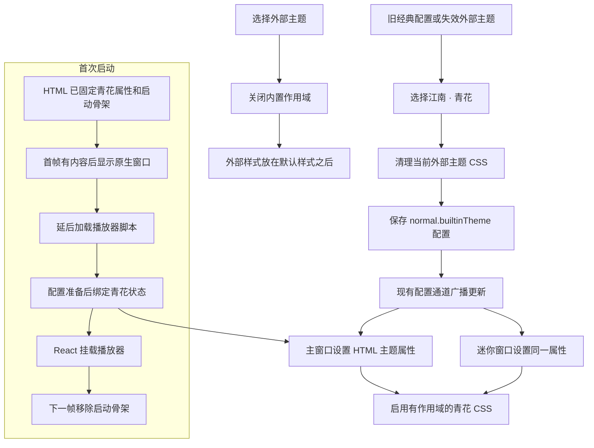
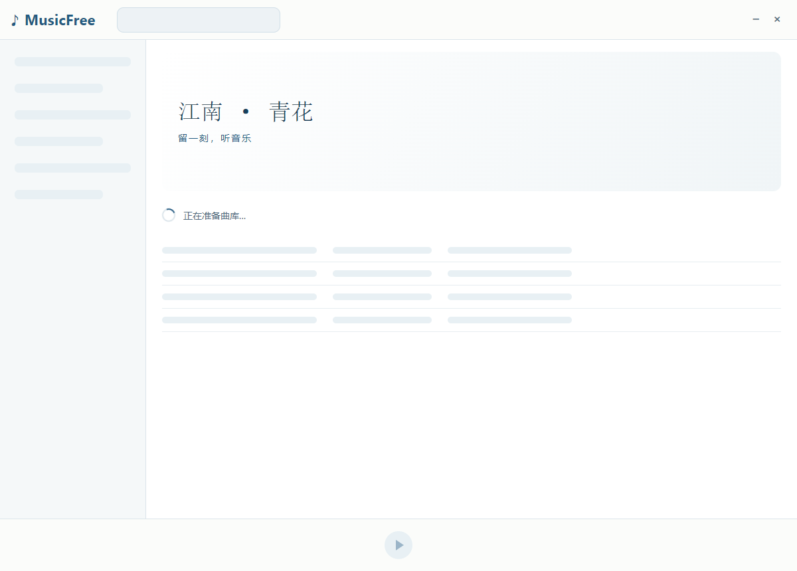

# 13 · 江南 · 青花：主题实现与运行验证

[返回目录](README.md) · [开发前效果图](12-jiangnan-porcelain-theme.md)

> 本章展示**Windows 编译版的实际截图**。主题在 `preview/jiangnan-porcelain` worktree 中独立开发，现已合入 `dev`。外部主题样式优先级修复与青花主题分别提交；当前分支既有的下载同步、启动优化和写实唱片代码一并保留。

## 1. 主界面与批量选择


[打开主界面原尺寸截图](assets/previews/jiangnan-actual-main.png)


主窗口使用青花蓝按钮、淡蓝选中行和瓷白阅读区域。江南插画位于歌单头部，荷花点缀侧栏底部。歌曲自己的封面仍会显示；没有设置歌单封面时，水乡背景作为头部装饰。字号和文字使用系统字体，表格仍保留原来的行高，避免影响虚拟滚动。

## 2. 唱片详情与迷你窗口


[打开详情原尺寸截图](assets/previews/jiangnan-actual-detail-playing.png)


当前歌词使用青花蓝，其他歌词使用墨灰。唱片展示尺寸在此主题中放大为 `min(52vmin, 42vw)`，唱片内部几何和播放状态逻辑沿用当前分支的写实唱片实现；隐藏与减少动态效果规则保持有效。


迷你窗口仍是 340 × 72，封面仍为 56px；正常显示歌词，悬停显示操作按钮。它采用适合真实尺寸的精简布局，开发前效果图中的放大迷你示意没有照搬为更大的窗口。

## 3. 切换主题与同步


青花现在是默认内置主题，首次 HTML 已带主题属性，配置准备后、播放器挂载前绑定主题更新。主题页已移除旧橙色「默认」入口。旧经典配置、缺失或失效的主题包会回到青花；有效外部主题仍可安装和选择，主窗口与已经打开的迷你窗口继续同步。



外部主题验证中发现既有样式节点可能排在打包默认样式之前，导致同级 CSS 被覆盖。本轮在主题 preload 中将选中主题的样式节点移动到末尾，验证了覆盖优先级与重新加载后的恢复。

## 4. 代码范围

| 位置 | 作用 |
| --- | --- |
| `src/shared/themepack/builtin.ts` | 读取配置、设置主题属性、订阅配置更新；每个渲染窗口只绑定一次 |
| `src/shared/themepack/jiangnan.scss` | 配色、主窗口、歌单、详情、底部栏、迷你窗口与窄屏样式 |
| `src/shared/themepack/renderer.ts` | 内置与外部主题互斥选择，保留原主题包接口 |
| `src/shared/themepack/preload.ts` | 确保选中的外部主题在默认 CSS 之后 |
| `src/renderer-minimode/document/bootstrap.ts` | 配置准备后启用同一主题绑定 |
| `src/assets/imgs/themes` | 本地水乡与透明荷花 PNG 素材 |
| `src/types/app-config.d.ts` 与默认配置 | 增加内置主题选择项 |
| `src/renderer/components/MusicFavorite/index.tsx` | 收藏颜色读取主题变量，外部主题未定义收藏色时保留红色回退 |
| 歌单 Header 与 LocalThemes | 歌单封面判断和青花主题选择入口 |
| `src/renderer/components/Header` | MusicFree 使用 HTML 音乐符号与普通文字，保留完整字形和末尾留白 |
| `src/renderer/document/index.html` | 首帧骨架和共享音乐符号样式，播放器脚本加载前即可呈现 |

主题只在 HTML 的 `data-builtin-theme="jiangnan"` 属性存在时生效。没有在线素材、运行时生成图片、水面动画或 3D 引擎。背景与荷花使用内置 imagegen 生成，[水乡提示词](evidence/jiangnan-water-town-prompt.txt)、[荷花提示词](evidence/jiangnan-lotus-prompt.txt)与[示例封面提示词](evidence/jiangnan-demo-cover-prompt.txt)一并保留。

## 5. 验证与实际边界

| 检查 | 范围 |
| --- | --- |
| 静态门禁 | TypeScript、全库格式检查 |
| 既有回归 | 7 组 Windows Electron：下载、音频、歌单、启动、目录迁移、文件资源与唱片 |
| 真实编译版 | 六首示例歌曲、全选并取消一首、本地 WAV 播放、播放/暂停、详情、迷你同步 |
| 主题与首帧 | 旧经典配置迁回青花且没有橙色帧；外部主题优先级、失效回退、重载与迷你同步 |
| 素材 | 本地图片解码；荷花有真实透明像素和可见像素 |
| 窄屏 | 测试中临时解除最小宽度，验证真实 850px 主窗口；程序原最小宽度仍为 1050px |
| 启动 | worktree 预览阶段测量过 1000 条下载记录的首屏与后台核对；合入后执行现有启动回归，这次没有重测冷启动性能 |
| 知识库 | 离线图片、大图链接、章节入口、窄屏、打印与所有流程图 |

[验证记录](evidence/jiangnan-theme-results.json)包含实际环境、检查结果、源码和图片校验值。Linux/macOS GUI、不同 DPI 与长期使用仍需后续设备验收。本轮已合入 `dev`，没有推送到远端。


## 6. 如何运行当前编译版

Windows 可执行文件位于仓库的 `out/MusicFree-win32-x64/MusicFree.exe`，本轮没有生成 ZIP。旧编译包与安装包已清理；测试产物和日志收纳到隐藏的 `out/.history`，Git worktree 源码保留在 `out/worktrees`。

应用恢复正式名称 `MusicFree`，采用原有配置与单实例规则。已运行播放器时，先从托盘退出旧进程，再打开当前编译版。旧经典配置会迁回青花；有效外部主题选择仍会恢复。切换回青花可点击顶栏衣服图标，进入「本地」，选择「江南 · 青花」。

真实页面测试使用独立 profile 和六首虚构示例歌曲，截图用于说明界面；正式编译版没有预置示例歌曲、插件或测试配置。此前独立预览 EXE 的 `portable/userData` 不会自动迁入正式播放器。

主界面、底部播放栏、详情和迷你窗口共用同一主题配置。打开自己的歌单，播放歌曲，点击底部封面查看详情，再打开迷你窗口即可验收。主题素材来自本地 PNG，歌曲仍使用各自的专辑封面。

本章与第 12 章分别保留实际实现和开发前提案，便于对照调整。

## 7. 启动白屏、主题闪切与标志裁切



| 用户反馈 | 原因与修复 |
| --- | --- |
| 白屏数秒 | 原生窗口默认立即显示，HTML 只有空的 root，完整脚本执行前没有内容。现在窗口以 `show: false` 创建，本地 HTML 先提供青花骨架；约 4KB 启动脚本让出绘制机会后再加载完整播放器。首次有内容后显示窗口，正式界面绘制后移除骨架。 |
| 先显示旧主题 | 原来在 React 挂载后的异步主题初始化中才设置 HTML 属性。现在首个 HTML 就是青花，配置准备后提前绑定；旧橙色默认入口已移除。 |
| MusicFree 最后一个 e 裁切 | 此前为 SVG 增加留白后，用户仍看到末尾字形不完整。现将正式界面标志改成系统文字，与启动画面的字体、字重一致；按 `docs/ref/主题.png` 使用普通 F，在文字前增加 ♪ 音乐符号；取消固定高度，禁止压缩，按文字内容保留最小宽度，右侧额外留出 8px。 |
| 标志样式偏好 | 用户确认改用参考图中的「♪ MusicFree」。已撤下 CSS 圆角 F，音乐符号与文字共用主题颜色；符号是装饰，读屏仍读取 MusicFree。没有新增字体文件、SVG 或图片资源。 |
| 加载脚本失败 | 启动骨架提供错误与重新加载入口。初始化失败和 React 错误也会移除骨架，避免遮挡错误与重试界面。 |

使用首帧事件与窗口背景色的方式参考 [Electron BrowserWindow 文档](https://www.electronjs.org/docs/latest/api/browser-window#using-the-ready-to-show-event)。没有新增独立欢迎窗口、远程图片或启动音效。

### 计时应区分两个阶段

实际运行日志中，2026-10-05 有一次「创建主窗口 → 前端 Create Bundle」约 **8.686 秒**，随后到完整首屏约 **0.221 秒**。该日志区间包含窗口/渲染进程准备、preload 和脚本加载执行；不能据此把时间全部归给某一个库，也不是点 exe 到窗口出现的完整时间。1035 首文件核对发生在首屏之后，旋转唱片也在挂载后才出现。

本轮在真实 Windows 包中故意延迟播放器 chunk **3.2 秒**：观察到首次显示的是青花骨架，旧经典配置没有产生橙色帧；延迟结束后正常切换到可操作的播放器。脚本取消加载后的错误提示与重试恢复通过。此前只核对 SVG 边界，没有解决用户实际看到的字形问题；标志现改为文字，在 1050px、1200px 窗口下验证 100%、125%、150%、200% 页面缩放，共 8 种组合；等待 Chromium 实际完成缩放后，最后一个 e 的文字边界均位于可见范围，祖先节点没有裁切。已人工检查[最新标志截图](assets/previews/jiangnan-actual-wordmark.png)。当前采用「♪ MusicFree」；普通 F 与其余字母共用字体，音乐符号位于文字左侧，并核对符号颜色、间距和装饰性无障碍属性。[上一轮圆角 F 对照](assets/previews/jiangnan-wordmark-comparison.png)仅作为历史方案保留。页面缩放检查不代替 Windows 系统 DPI 设备验收。[查看加载失败截图](assets/previews/jiangnan-actual-startup-failed.png)。

缓存环境中的一次实际 EXE 启动验证用时约 **1.875 秒**，包含探测和轮询，**不是用户设备冷启动承诺**。真实冷启动、系统扫描和硬盘负载仍需设备实测。当前分别记录 `player-shell-painted` 与 `player-first-screen`，原生窗口记录 `Main Window First Paint`；不要把“出现骨架”写成“播放器已经可操作”。

### 复现与验证记录

从仓库根目录，在 Windows 编译包存在后运行：

```powershell
.\node_modules\.bin\electron.cmd docs/knowledge-base/evidence/packaged-startup-theme-check.cjs out/MusicFree-win32-x64
```

检查使用独立配置和虚构歌单，并拦截主题测试的协议注册；测试结果写入 `out`。本轮实际 EXE 验证使用临时便携目录，退出后清理，交付程序没有测试曲库或便携配置。[上一轮启动验证](evidence/porcelain-startup-results.json)保留启动优化与 SVG 留白方案的历史结果；[上一轮普通文字标志验证](evidence/wordmark-fix-results.json)保留改用普通文字后的检查结果；[上一轮 CSS 圆角 F 验证](evidence/rounded-wordmark-results.json)保留已撤下方案的结果；[最新音乐符号标志验证](evidence/music-note-wordmark-results.json)记录本轮 8 种组合、首帧样式、实际 EXE 检查与源码/包内文件校验值。第 5 节的主题验证记录保留合入当时的历史结果。
