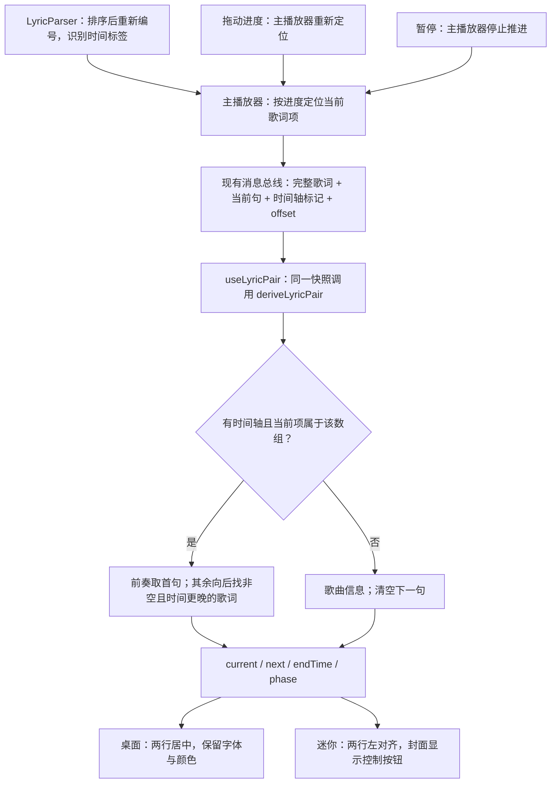

# 14 · 双行歌词：当前句＋下一句

[返回目录](README.md)

> **状态：已接入播放器，在独立 worktree 中开发和验证。** 从 `dev@631ae59` 创建分支 `feature/ktv-two-line-lyrics`，尚未合入 dev。本章记录实际实现、截图与验收；此前确认的交互样式作为对照保留。

## 1. 实际效果与使用

播放带时间戳的歌词，打开桌面歌词或迷你窗口即可显示双行，无需另开双句模式。**上行是当前句，下行是下一句原文**；译文继续在歌曲详情阅读。目标是在唱当前句时提前看到下一句。普通 LRC 只有整句起始时间，本轮没有新增逐字着色。

### 桌面歌词


[打开原尺寸截图](assets/previews/ktv-actual-desktop-playing.png)

窗口保持透明。上图来自真实 Windows Electron 窗口截图；查看器的背景不是播放器新增的实色底板。已有字体、颜色、锁定、鼠标穿透和拖动设置继续生效。

### 迷你窗口


保持 340×72 px。当前句 15 px，下句 13 px，长句单行省略并提供全文提示。悬停或键盘聚焦封面后显示上一首、播放/暂停、下一首和返回主窗口按钮，两行歌词保持可见。唱片仍根据播放状态旋转。

### 已确认的设计对照


[交互样式预览](assets/previews/ktv-two-line-preview.html)保留开发前方案，可切换前奏、间奏、末句、长句、无歌词、纯文本和字号。预览不播放音频，也不读取播放器状态；其“待接入”等说明属于历史提案。上述编译版截图才是本轮实际运行效果。

## 2. 状态规则

| 场景 | 上行 | 下行 |
| --- | --- | --- |
| 正常播放 | 当前歌词 | 后续有文字且时间严格更晚的一句 |
| 到下一句时间 | 新当前句 | 新下一句，两窗口使用同一快照 |
| 前奏／快退到首句前 | 歌曲信息 | 第一段可唱的歌词 |
| 空白间奏 | “间奏”提示 | 后续第一段有文字的歌词 |
| 暂停 | 保持当前句 | 保持下一句，长句动画也暂停 |
| 最后一句 | 最后一句 | 留空并保留高度，不回绕 |
| 切歌／歌词加载 | 新歌曲信息 | 清空，避免旧歌下一句残留 |
| 无歌词／纯文本 | 歌曲信息或无歌词提示 | 留空；纯文本仍可在详情阅读 |
| 只有一条 `[00:00]` | 该句正常显示 | 留空，不误判成纯文本 |
| 同一时间戳的和声 | 遵循现有当前句定位 | 跳过同时间戳，预告后续时刻 |

## 3. 数据流程与代码地图



可类比嵌入式界面：主播放器维护时间和状态，两个展示窗口从同一快照投影文本。**没有新增歌词请求、整库扫描或独立播放时钟**。下一句从内存中的完整歌词数组取得，仅在歌词数组、当前项或时间轴标记变化时计算；现有进度消息不触发整首重扫。

| 文件 | 职责／本轮变化 |
| --- | --- |
| `src/renderer/utils/lyric-parser.ts` | 排序后统一 index；识别有无时间标签，保留原翻译解析 |
| `src/renderer/core/track-player/index.ts` | 按当前项变化发事件；修复连续两句文字相同时漏切句，以及首次歌词到达漏发当前项 |
| `src/renderer/document/bootstrap.ts` | 完整歌词、当前句和文本同批更新；切歌清空；当前句为空时安全处理 |
| `src/shared/message-bus/type.d.ts` | 补充可选 `lyricHasTimeline` 和 `lyricOffset`，不增加进度消息频率 |
| `src/renderer/utils/lyric-pair.ts` | 共享纯函数：前奏、间奏、末句、同时间戳和过时快照规则 |
| `src/renderer/utils/use-lyric-pair.ts` | 共用订阅入口；从同一状态快照推导双句 |
| `src/common/lyric-layout.ts` | 字号限制、两行比例、窗口高度正向与反向换算 |
| `src/main/window-manager/index.ts` | 根据共享规则调整桌面窗高度与缩放反推；迷你窗保持原尺寸 |
| `src/renderer-lrc/pages/index.tsx` | 桌面双行、实际文字测量、当前长句随进度滚动、下一句缓慢滚动 |
| `src/renderer-minimode/pages/index.tsx` | 迷你双行与封面控制按钮；不再用悬停控件替换整块歌词 |

### 顺带修复的三个同步问题

1. **乱序歌词 index 不对应数组位置。** 解析器排序后重新编号，共享函数仍校验时间、文字和 index，不能把旧当前项与新歌词数组拼接。
2. **重复文字漏切句。** 以前只比较文字，相同歌词在不同时间出现时不会通知窗口；现在比较当前歌词项，下一句也能按时间正确推进。
3. **首次歌词或前奏当前项为空。** 首次完整数组与当前项一起同步，空当前项不再访问 `.lrc`，快退到零能恢复首句预告。

## 4. 布局、长句与性能边界

### 桌面尺寸共用一套公式

```text
F = 当前句字号，限制 16～80 px
下句字号 = 0.78 × F
行高 = 1.15；两句间距 = 8 px；窗口边框与操作区 = 60 px
H = ceil(60 + 8 + F × 1.15 × 1.78)
```

F=16／54／80 对应 H=101／179／232 px。主进程最小/最大高度、字号变化和拖动缩放反推都使用同一规则，防止 resize 事件将字号反复缩小。已有自定义字体颜色保留；无配置时采用青蓝当前句、灰蓝下一句和深色细描边。

当前长句依据主播放器进度及 LRC offset 滚动，暂停不推进，回退后重算位置。`endTime` 包含下一空白段的起点，因此当前长句不会穿过间奏才结束。下一长句按实际溢出宽度缓慢滚动，暂停／悬停时停止，并尊重减少动态效果设置。ResizeObserver 在卸载时释放。

迷你窗口两句独立省略，不换行；青花内置主题使用已确认的蓝色卡片。其他主题保留主题样式，未强制覆盖所有外部主题。未新增逐字时间戳推断，也未对整个播放器做架构改造。

## 5. 验证与复现

| 层次 | 检查内容 |
| --- | --- |
| Node 源码回归 | 真实解析器与共享函数：乱序、重复文字、同时间戳、空白、前奏、末句、零时单句、纯文本、翻译、正负 offset、16～80 字号换算 |
| 主播放器回归 | 首次歌词同时发当前项；重复文字按时间切换；同一项不重复通知；快退到零与清空 |
| Electron 组件回归 | 真实 React、SCSS、消息状态订阅和 ResizeObserver：两窗一致、长句暂停/恢复/回退、16/54/80 排版、340×72 迷你窗、控件命令、唱片稳定、减少动态效果与卸载清理 |
| 完整门禁 | 9 组 Node、8 组 Windows Electron 回归；格式检查、TypeScript 检查、ESLint 无错误（138 项既有警告） |
| 编译产物 | Windows x64 构建；实际 EXE 的 Electron Node 模式检查资源、原生 SQLite/Sharp 与 ABI |
| 编译页面验收 | 未修改的打包主进程/preload/renderer，由相同版本 Electron 承载；静音本地 WAV、真实窗口与 MessagePort、暂停/切歌/seek/字体高度、离线截图 |
| 知识库网页 | file:// 离线打开；15 张流程图、实际截图解码、章节切换、窄屏、打印和单图失败隔离 |

[实现验收记录](evidence/ktv-two-line-results.json)保存平台、检查结果、截图和源码校验值。[预览历史验证](evidence/ktv-two-line-preview-results.json)只对应开发前交互样式。

运行新增测试：

```powershell
node scripts/tests/lyric-regression.cjs
.\node_modules\.bin\electron.cmd scripts/tests/electron-regression-main.cjs lyric
.\node_modules\.bin\electron.cmd docs/knowledge-base/evidence/packaged-ktv-check.cjs out/MusicFree-win32-x64
```

测试使用独立 profile 和静音示例歌曲，不操作正常歌曲库。编译页面验收使用与包内相同的 Electron 25.3.0；实际 EXE 的原生模块另行检查。这不等于所有在线歌词源、Windows 缩放倍率或 Linux/macOS GUI 都已验收；仍请手动检查自己的歌词、桌面背景、锁定／穿透和常用主题。

## 6. 本地试用入口

- 分支：`feature/ktv-two-line-lyrics`，基线 `dev@631ae59`，尚未提交或合入 dev。
- worktree：`F:\brraida\MusicFreeDesktop\MusicFreeDesktop\out\worktrees\ktv-two-line`。
- 播放器：该目录下 `out\MusicFree-win32-x64\MusicFree.exe`，保留完整同目录资源；本轮不生成 ZIP。
- 知识库：该目录下 `docs\knowledge-base\index.html`，第 14 章。
- 本轮源码与文档只修改这个 worktree；其他工作区中的后续开发不在本轮改动范围。
