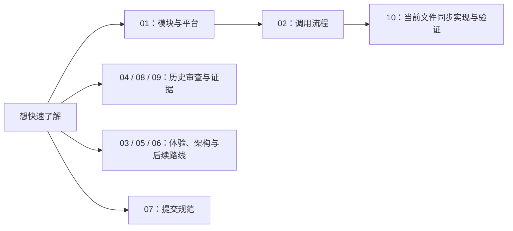

# MusicFreeDesktop 知识库与优化评估

> 历史审阅：`6bb1e21`（等价整理版 `5c2d332`）· 第一阶段修复：`5806cdf` · 本轮基线：`dev@4e7b711` ；本轮实现按下载同步、播放恢复、启动优化和唱片效果分别提交 · 更新：2026-10-05。
> 面向有 C/C++ 和嵌入式开发经验、了解 HTML/CSS/JavaScript 的维护者。第一阶段保留现有架构，先修复与验证。

## 阅读入口

以 Markdown 文档为主，架构、状态和时序使用可编辑的 Mermaid 或 PlantUML 定义。[离线阅读页](index.html)显示流程图，支持章节切换、搜索和打印；每张图下方可展开对应源码。Mermaid 在网页中渲染；第 10 章的 PlantUML 使用本地预生成 SVG，并提供“打开大图”。也可在支持 Mermaid 的 Markdown 预览中阅读原稿。

直接用浏览器打开 `index.html`，不需要安装浏览器扩展、Java、PlantUML、Mermaid CLI 或启动服务器。渲染库已保存在 `vendor/mermaid`，PlantUML 图形保存在 `assets/plantuml`；复制文档时请保留整个 `knowledge-base` 目录，离线也能显示图形。

| 文档 | 回答的问题 |
| --- | --- |
| [01 代码库知识地图](01-codebase.md) | 软件由哪些模块组成，入口和数据在哪里？ |
| [02 核心流程与 Windows 开发指南](02-flows-and-development.md) | 如何播放、下载、扫描、构建和排查？ |
| [03 播放器对比与体验优化清单](03-product-improvements.md) | 与 foobar2000、MusicBee、AIMP 相比，优先补什么？ |
| [04 Bug、风险与代码优化清单](04-code-audit.md) | 哪些问题已复现，哪些仍需实测，如何验收？ |
| [05 Windows 架构与语言选型](05-windows-architecture.md) | 要不要重构，Electron、Tauri、C#、C++ 如何选择？ |
| [06 实施路线与性能验收](06-roadmap.md) | 先做什么，如何判断真的更流畅？ |
| [07 代码提交规范](07-commit-convention.md) | 今后如何拆分、命名、验证和提交改动？ |
| [08 Brraida 提交审查（2026-10-04）](08-code-review-2026-10-04.md) | 最近 28 个提交有哪些需要优先处理的问题？ |
| [09 审查验证与复现](09-review-evidence.md) | 哪些检查通过了，问题如何复现，哪些尚未验证？ |
| [10 下载文件状态同步](10-download-file-state.md) | 当前如何监听、核对和恢复文件？本地播放失败如何回退？有哪些验证和限制？ |
| [11 唱片播放效果](11-vinyl-player-preview.md) | 查看已接入的写实金属唱臂与黑胶素材、实际截图、三处适配与状态规则 |
| [12 江南 · 青花主题预览](12-jiangnan-porcelain-theme.md) | 已确认的开发前效果图，供与实际页面对照 |
| [13 青花主题实际预览](13-jiangnan-theme-implementation.md) | 已合入 dev 的主题、真实编译截图、切换同步与运行入口 |

**当前主题实现：** [13 青花主题实际预览](13-jiangnan-theme-implementation.md)。青花主题已从独立 worktree 合入 `dev`，并补修启动白屏、首帧主题和标题裁切；[12](12-jiangnan-porcelain-theme.md)保留开发前效果图。

## 主要结论

1. **仓库是跨平台项目。** README、构建工作流和平台分支均支持这一判断；当前 Windows 构建不代表整个仓库只支持 Windows。
2. **第一阶段不做架构重构。** 在现有模块内修复播放竞态、扫描、服务生命周期和资源释放，补充回归与性能基线。
3. **继续使用 TypeScript、React、Electron 与当前数据库。** 第一阶段不拆进程、不迁移数据库、不换语言；接口的必要小修以具体问题为边界。
4. **架构与语言选型留作后续备选。** C/C++ 可用于未来有明确需求的原生音频/系统模块；Windows 专用 UI、Tauri 和其他方案均需单独验证收益与兼容成本，尚未决定采用。
5. **第一阶段 BUG-01～13 已修复，并补修短损坏文件的 BUG-14。** 已通过 Windows Node 回归、真实 Electron 音频/歌单/启动/下载验证及类型检查。仍需保留设备、音源、Linux/macOS 验收和安全迁移的边界，详见 [04 的状态表](04-code-audit.md)。
6. **本轮已实现下载文件状态同步。** 外部删歌、目录删除/恢复、修改下载目录、暂不可用和实际打开失败均有核对或恢复路径；任务进度与资源可用性分别维护。实现、状态机和验证统一收录在 [10](10-download-file-state.md)。

7. **本轮已优化启动等待。** 下载文件核对在后台分批执行，点播和下载优先检查目标；唱片效果保留。流程、测量与边界见 [02](02-flows-and-development.md)。

**最新提交审查：** [08](08-code-review-2026-10-04.md)以 `master..dev@4e7b711` 的 Brraida 提交为范围，列出 3 项 P1 数据风险和 2 项 P2 功能问题；[07](07-commit-convention.md)给出适合本仓库的提交规范，[09](09-review-evidence.md)记录验证过程。04 是较早基线的代码审查，问题编号和范围分别保留。



## 图定义与证据说明

- Mermaid 定义直接保存在 Markdown 中，便于随源码修改；视觉方案与实际截图保存在 `assets/previews`，正文区分开发前示意与当前实现。
- 网页使用随文档保存的 Mermaid 库渲染 SVG；隐藏章节通过独立测量容器完成布局，切换章节无需重新绘图。渲染失败会保留错误与源码，不显示为空白。
- 第 10 章的两份 PlantUML 源码保存在 `docs/design/download-file-state`，本地生成 SVG 后嵌入网页。生成器检查源码和 SVG 校验值，避免图与源码不同步；详见 [图维护步骤](10-download-file-state.md)。
- [历史复现脚本](evidence/audit-repro.cjs)通过 `git show` 加载原基线 TypeScript 方法，模拟音频、子进程和数据库边界；[历史结果](evidence/audit-results.json)记录基线和环境。
- [当前回归方法](../../scripts/tests/README.md)和 [第一阶段验证结果](evidence/bugfix-results.json)覆盖修复后的行为。本轮未测量完整播放器性能，也未把隔离实验视为全设备实机测试。
- [下载文件同步结果](evidence/download-file-sync-results.json)记录本轮门禁；Windows 执行完整回归，WSL Linux 执行文件检查与原生监听回归，macOS 尚未运行验收。
- [唱片效果结果](evidence/vinyl-player-results.json)记录后续的 7 组 Windows Electron 门禁与编译页面验收，第 11 章展示实际截图。

## 评估口径

| 标签 | 含义 |
| --- | --- |
| 隔离复现 | 实际源码在明确的模拟条件下出现问题，有脚本和断言 |
| 静态确认 | 源码路径或缺失行为可确认，尚未完成端到端复现 |
| 待实测 | 影响程度、设备相关表现或异常时序需实际验证 |
| 建议 | 新功能、架构方案或性能目标，尚未实现 |
| 已完成 | 已在基线中实现，并有此前的测试或用户验证 |

优先级：**P0** 为发布前应处理的高影响边界；**P1** 为播放、数据和任务可靠性；**P2** 为日常体验与可维护性；**P3** 为有需求后再做的能力。优先级是本次建议，不是测得的事故频率。

## 基线与维护方式

- 当前版本为 `0.0.80`；本轮保留此前确认的版本号，并同步 `package-lock.json` 的两处根版本字段，依赖图未变化。开发前基线 `4e7b711` 的版本为 `0.0.8`。
- 当前扫描 `src`：463 个文件，其中 162 个 `.ts`、121 个 `.tsx`、105 个 `.scss`。数量只说明规模，不说明质量。
- 竞品与框架能力依据官方资料，在对应段落给出链接。官网宣称的内存数字未用于横向性能结论。
- 后续修复时更新问题状态、证据和基线；同一问题编号保持稳定。性能结果须同时注明机器、操作系统、数据规模和测量方法。

修改 Markdown 或 Mermaid 定义后，可在仓库根目录重新生成离线阅读页：

07、08、09 的 Markdown 是入口页，正文只维护一份：原稿分别在仓库根目录的 `COMMIT_CONVENTION.md`、`CODE_REVIEW_2026-10-04.md` 和 `docs/reviews/2026-10-04/README.md`。生成器直接读取原稿并转换相对链接，避免复制正文后漏同步。历史审查保留当时结论；当前文件同步统一维护第 10 章。

```powershell
python docs/knowledge-base/evidence/build-docs.py
```

生成器仅依赖 Python 3 标准库。历史复现脚本需要 npm 依赖和保留的基线 Git 对象，会更新 `evidence/audit-results.json`；当前修复验收请运行 scripts/tests 下的回归。

### 网页流程图回归

已有 Windows Electron 依赖时，在仓库根目录运行：

```powershell
.\node_modules\.bin\electron.cmd docs/knowledge-base/evidence/browser-render-test.cjs
```

测试使用独立 profile，以 `file://` 加载真实阅读页并阻止 HTTP(S) 请求；检查 14 张图（12 张 Mermaid、2 张 PlantUML）的 SVG、尺寸和标签、章节切换、窄屏、打印、源码展开、大图链接，以及单图失败时其他图继续渲染。[结果](evidence/browser-render-results.json)记录实际浏览器版本，截图路径位于忽略提交的 `out` 目录。

渲染库的版本、许可证和校验值见 [vendor 说明](vendor/mermaid/README.md)。

**推荐阅读顺序：** 01 的执行模型与平台矩阵 → 02 的调用流程 → 10 的当前实现与验证。查历史风险再看 04、08、09；规划后续工作看 03、05、06；提交前看 07。
