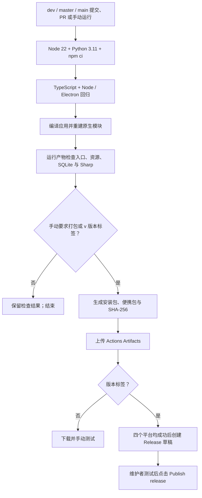

# GitHub CI/CD

配置入口：[build.yml](../.github/workflows/build.yml)。本地开发只生成可运行目录，发布归档由 GitHub Actions 生成。

## 流程



| 平台 | runner | 发布文件 |
| --- | --- | --- |
| Windows x64 | `windows-2022` | Squirrel 安装器 EXE、包含 `portable/` 的便携 ZIP |
| Linux x64 | `ubuntu-24.04` | DEB、保留执行权限的 tar.gz |
| macOS Intel | `macos-15-intel` | DMG、应用 ZIP |
| macOS Apple Silicon | `macos-15` | DMG、应用 ZIP |

runner 标签与架构按 [GitHub 官方 runner 列表](https://github.com/actions/runner-images#available-images)配置，运行时再次检查实际架构。四个作业各自安装依赖和编译，避免跨系统复用原生 `.node` 文件。

## 日常提交

- `dev`、`master`、`main` 的 push 和目标为这些分支的 PR 自动运行。
- 每个平台执行类型检查、七组 Node 回归、五组 Electron 回归，以及应用编译和产物验证。Linux 使用 Xvfb 提供虚拟显示，并为测试安装的 Chromium 沙箱辅助程序设置 root 所有者和 4755 权限。
- 普通提交不生成发布归档。测试日志与结果保留 7 天；失败时也尝试上传已有结果。
- 安装使用锁文件和 npm 官方 registry，依赖版本及 integrity 不随 CI 更新。缓存 npm 下载，不缓存 `node_modules`。

## 手动生成测试包

1. 打开仓库的 **Actions**，选择 `.github/workflows/build.yml` 对应的工作流。
2. 点击 **Run workflow**，选择 `dev`，勾选 `build_packages`。
3. 成功后，从运行页面的 **Artifacts** 下载 `release-win32-x64`、`release-linux-x64`、`release-darwin-x64` 或 `release-darwin-arm64`。

发布文件保留 14 天。每个平台附带 `SHA256SUMS-平台-架构.txt` 和 `build-info-平台-架构.json`，用于核对下载完整性、版本、commit 和构建日志。

GitHub 的手动入口要求默认分支存在该工作流文件；仓库默认分支是 `master`，已有同路径手动工作流。若默认分支仍是旧配置，页面可能继续显示原工作流名称或旧输入，可使用 GitHub CLI 指定 `dev` 执行：

```sh
gh workflow run build.yml --repo Brraida/MusicFreeDesktop --ref dev -f build_packages=true
```

参见 [GitHub workflow_dispatch 文档](https://docs.github.com/en/actions/reference/workflows-and-actions/events-that-trigger-workflows#workflow_dispatch)。

## 创建版本发布草稿

先提交所需代码与 `package.json` / `package-lock.json` 的版本更新，再给该提交加标签。例如，只有版本为 `0.0.80` 的已提交代码才使用 `v0.0.80`：

```sh
git tag v0.0.80
git push origin v0.0.80
```

标签必须与 `package.json` 的版本完全匹配，否则流程在安装依赖前失败。四个平台都通过检查并产生产物后，使用内置 `GITHUB_TOKEN` 创建草稿并上传文件，维护者下载测试后手动发布。重跑可更新同版本草稿；已经正式发布的 Release 不会被覆盖。

新流程不依赖个人 PAT、`MYAPPID`、飞书或 GitCode secret。构建权限为 `contents: read`，只有标签触发的草稿发布作业使用 `contents: write`。Windows 使用现有 Forge Squirrel maker，旧 Inno Setup 脚本仍可单独使用。

macOS ZIP 使用 Forge；DMG 使用系统自带的 `ditto` 和 `hdiutil`，包含应用及指向 `/Applications` 的拖拽安装链接，并执行 `hdiutil verify`。这样避免旧 `appdmg` 可选依赖安装失败导致全部安装包生成失败。

## 验证边界

- 工作流使用目前仓库锁定的 Electron 和 Forge，不在配置 CI 时升级播放器宿主。
- 原生库验证使用刚编译出的 Electron 可执行文件，检查 SQLite 模块加载、Sharp 实际图片处理和必要资源；不等同于各平台全部设备与功能测试。
- Windows 安装包和 macOS 应用未配置代码签名或 Apple 公证。若需要正式签名发布，后续接入维护者自己的证书与相应 secret。
- 本地已验证回归入口、Windows 产物验证、版本与产物管理脚本和 workflow 语法；各平台的全新依赖安装及打包结果见下方实际试跑记录。

## 实际试跑记录

2026-10-03 在 `dev` 提交 `5024d0a` 上手动触发完整打包：[GitHub Actions 运行记录](https://github.com/Brraida/MusicFreeDesktop/actions/runs/37112835076)。使用已提交的版本 `0.0.8` 和 Node 22。

| 平台 | 类型检查、7 组 Node / 5 组 Electron 回归、编译及原生模块验证 | 安装包与归档上传 |
| --- | --- | --- |
| Windows x64 | 通过 | EXE、便携 ZIP |
| Linux x64 | 通过 | DEB、tar.gz |
| macOS Apple Silicon | 通过 | DMG、ZIP |
| macOS Intel | 通过 | DMG、ZIP |

首轮发现的 Linux 沙箱辅助程序权限和 macOS `appdmg` 缺失问题已分别修复。试跑使用手动构建入口；版本标签创建 Release 草稿的流程已做脚本回归，尚未实际发布。产物通过构建与资源检查，仍需人工测试播放、下载、设备输出和安装体验。

## 本地验证 CI 辅助脚本

在已经安装正确平台依赖的环境中运行：

```sh
node scripts/ci/run-tests.cjs node
node scripts/ci/run-tests.cjs electron
```

Linux 的第二条使用 `xvfb-run -a node scripts/ci/run-tests.cjs electron`。`ci-regression` 使用独立临时目录和 GitHub CLI 替身，验证路径、版本标签、校验和、隐藏资源和便携目录，以及草稿更新/正式发布保护，不创建真实 Release。

构建与 CI 脚本分别负责：

| 脚本 | 职责 |
| --- | --- |
| `run-tests.cjs` | 执行回归，记录日志与非零退出状态 |
| `build-info.cjs` | 计算平台路径、版本标签校验、构建来源 |
| `verify-build.cjs` / `verify-runtime.cjs` | 使用应用自己的 Electron 验证打包产物 |
| `collect-artifacts.cjs` / `archive.py` | 收集安装器和完整便携包，输出 SHA-256 与来源信息 |
| `create-dmg.cjs` | 在 macOS runner 上保留应用结构、生成并校验 DMG |
| `create-release.cjs` | 检查四平台产物，创建或更新 Release 草稿 |
